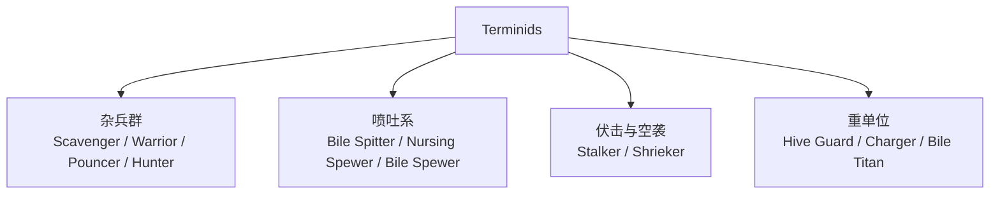
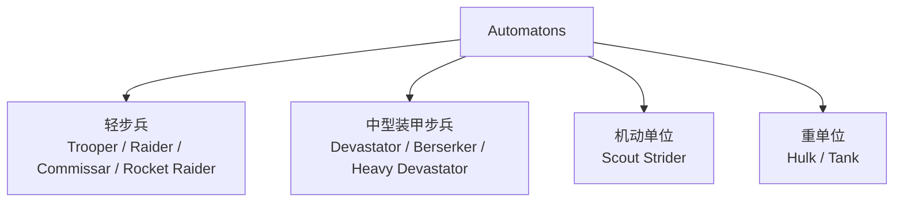
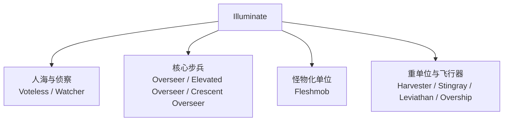

# Helldivers 2 三阵营敌人与弱点整理

数据快照日期：2026-04-26  
文档状态：`v0.1 初稿，可持续补全`

> 时间说明：官方在 2026-02-10 的更新公告中已确认 `Cyborg` 作为 Automaton 战线下的新子派系回归。本文档当前仍按你的要求，以三大主阵营 `Terminids / Automatons / Illuminate` 为主轴整理，后续可在 Bot 章节下追加 `Cyborg` 分支。

## 中文译名校对说明

本版已查阅中文 Wiki 后重新校对译名。当前结论如下：

- `Terminids`：中文 Wiki 可见译名为 `终结族`。
- `Automatons`：中文社区存在 `机器人` 与 `生化人` 两种叫法；其中较新的中文维基页面正文可见 `机器人`，B 站 Wiki 导航栏可见 `生化人`。
- `Illuminate`：较新的中文维基页面正文可见译名 `光能者`。

因此，本文档当前统一采用：

- `Terminids = 终结族`
- `Automatons = 机器人`
- `Illuminate = 光能者`

说明：

- 阵营级译名按中文 Wiki 现有页面优先。
- 单位级译名本次已按中文 Wiki、中文社区图鉴、中文新闻稿常用写法完成一轮全面校对。
- 少数 2025-2026 新增单位在中文公开资料中仍未形成完全统一叫法，文中会直接标注 `中文资料未统一`，避免把单一社区写法误当成官方定名。

## 目标与原则

这份文档用于整理《Helldivers 2》三大主要敌对阵营的敌人清单、基础装甲/出现场景信息、已确认弱点，以及后续补完计划。

当前版本遵循两条原则：

1. 先把“能确认的”写实，再把“待补完的”单独标注。
2. 弱点信息优先采用敌人页面、社区 Wiki 战术段落与官方公告交叉整理；个别条目若只有装甲分区可用，会明确标记为“推断”。

## 任务拆解

- [x] 建立文档骨架与版本说明
- [x] 汇总三阵营敌人总表
- [x] 整理第一批高优先级敌人弱点
- [x] 为三阵营加入示意图
- [ ] 为 Terminid 补完全部普通/精英单位战术
- [ ] 为 Automaton 补完轻步兵、狂战士、火箭系与炮塔系细节
- [ ] 为 Illuminate 补完 Stingray、Leviathan、Overship、Warp Ship、Appropriators
- [ ] 将外部资料中的示意图替换为本地图片素材
- [ ] 二次校对版本差异，确认 2025-2026 更新后的新单位覆盖

## 阵营总览

| 阵营 | 作战风格 | 典型威胁 | 通用处理思路 |
| --- | --- | --- | --- |
| 终结族 | 近中距离集群冲锋、地面压迫 | 高速近战、喷吐、巨体压制 | 快速清杂兵，优先拆头部、口器、腹囊，重武器留给大型重甲单位 |
| 机器人 | 远程火力、装甲步兵、机械重单位 | 火箭、机炮、装甲正面 | 利用掩体，打头部、散热器、背部通风口，反甲武器专打重甲 |
| 光能者 | 护盾、高机动、城市战、肉盾海 | 护盾、心控杂兵、光束重单位 | 先破盾再点杀核心，控住监视者，重火力拆收割者腿部与关节 |

## 阵营示意图

### Terminids

### Automatons

### Illuminate

## 数值速查

说明：

- 本节优先记录 `主生命值`、`关键弱点部位生命值`、`主装甲等级`、`特殊倍率/说明`。
- 数据主要来自 `helldivers.wiki.gg` 当前页面，页面显示的游戏版本为 `1.006.102`。
- 少数敌人会随难度改变生命值或装甲，表中已单独标出。
- 若某条目暂时只拿到主生命值而没有完整部位表，我会写成 `主生命已确认，部位待补`。

### 终结族数值

| 中文名 | 英文名 | 主生命值 | 关键部位生命值 | 主装甲 | 特殊说明 |
| --- | --- | --- | --- | --- | --- |
| 食腐虫 | Scavenger | 60 | 肢体 30 | 无甲 I | 低血量杂兵，任何武器都能轻松清理。 |
| 猛扑虫 | Pouncer | 60 | 页面主生命已确认，部位待补 | 无甲 | 极低韧性，跳扑威胁高于血量。 |
| 追猎虫 | Hunter | 130（中等及以下）/ 160（挑战及以上） | 头 40；爪 45/60；腿 45/60；翼 20 | 无甲 I | 难度提升后主生命与肢体血量上升。 |
| 武斗虫 | Warrior | 250（中等及以下）/ 325（挑战及以上） | 头 110/150；爪 75/100；腿 75/100 | 无甲 II | 腿部与头部都能高效转伤主血。 |
| 虫巢守卫 | Hive Guard | 500 | 头 250；前腿 125；后腿 125 | 主体轻甲；头/爪中甲 | 正面中甲是其难点，颈部缝隙与腿部仍可处理。 |
| 虫族指挥官 | Brood Commander | 800 | 头 200；爪 200；腿 170 | 轻甲 | 头部致命，但打腿更稳，且会高比例转伤主血。 |
| 护理喷涌虫 | Nursing Spewer | 750 | 口 250；脊板 500；臀囊 750 | 主体轻甲 | 口器与臀囊都可致命；臀囊高耐久但可造成大额转伤。 |
| 喷涌虫 | Bile Spewer | 750 | 头 300；口 250；脊板 500；臀囊 750 | 轻甲；极限难度主体/头部升为中甲 | 从极限难度开始，头部与主体更难被轻穿武器处理。 |
| 强袭虫 | Charger | 2400 | 头 600（页面变更记录已确认）；主生命 2400 | 重甲 | 腿甲被拆后肉腿更适合主武器补刀。 |
| 追踪虫 | Stalker | 800 | 头 175；翼 125 | 主体无甲 II；背甲轻甲 | 伪装时会回复约 50 生命/秒，拖延越久越难杀。 |
| 尖啸虫 | Shrieker | 80 | 头 30；肢体 30；翼 20 | 无甲 I | 血量很低，但俯冲与坠尸伤害危险。 |
| 吐酸泰坦 | Bile Titan | 6500 | 主生命已确认；部位表待补 | 重甲 | 火焰承伤 1.7 倍；口部和腹囊仍是实战重点。 |

### 机器人数值

| 中文名 | 英文名 | 主生命值 | 关键部位生命值 | 主装甲 | 特殊说明 |
| --- | --- | --- | --- | --- | --- |
| 装甲兵 | Trooper | 125 | 头 40；躯干 100；手臂 65；腿 90 | 无甲 I | 轻型机器人通用模板之一。 |
| 劫掠者 | Marauder | 125 | 主生命已确认，部位待补 | 轻甲化轻型单位 | 比装甲兵更耐打，但仍属于轻型。 |
| 政委 | Commissar | 125 | 头 40；躯干 100；手臂 65；腿 90 | 无甲 II | 页面明确说明：并非只有政委能叫空投，所有轻型机器人都可能打信号弹。 |
| 机枪奇袭者 | MG Raider | 125 | 主生命已确认，部位待补 | 轻型 | 背包爆炸可造成 130 爆炸伤害和 100/秒燃烧。 |
| 火箭奇袭者 | Rocket Raider | 125 | 主生命已确认，部位待补 | 轻型 | 火箭爆炸 70，直击 30。 |
| 特攻奇袭者 | Assault Raider | 125 | 主生命已确认，部位待补 | 轻型 | 喷气背包爆炸 130，并附带持续燃烧。 |
| 侦察纵步者 | Scout Strider | 500 | 驾驶员是实际弱点；机体主生命 500 | 重甲步行机 | 正面机体硬，但驾驶员暴露。 |
| 狂暴者 | Berserker | 750 | 主生命已确认，部位待补 | 中型 | 近战型中单位，主血与蹂躏者同级。 |
| 蹂躏者 | Devastator | 750 | 头部为关键弱点；完整部位表见页面 Anatomy | 中甲；头部轻甲/低甲弱点 | 火箭型、重型都沿用 750 主生命基线。 |
| 重型蹂躏者 | Heavy Devastator | 750 | 主生命已确认，头部关键弱点延续蹂躏者逻辑 | 中甲 | 正面大盾压制更烦，数值与普通蹂躏者接近。 |
| 火箭蹂躏者 | Rocket Devastator | 750 | 主生命已确认，头部关键弱点延续蹂躏者逻辑 | 中甲 | 主要威胁来自火箭齐射而不是血量差异。 |
| 强袭巨型者 | Hulk Bruiser | 1800 | 头部、背部散热器为关键弱点 | 重甲 | 火焰承伤 1.5 倍。 |
| 喷火巨型者 | Hulk Scorcher | 1800 | 头部、背部散热器为关键弱点 | 重甲 | 贴脸最危险的浩克变种之一。 |
| 歼灭巨型者 | Hulk Obliterator | 1800 | 头部、背部散热器为关键弱点 | 重甲 | 火箭双臂压制强，数值与其他浩克一致。 |
| 歼灭者坦克 | Annihilator Tank | 3000（车体）/ 2100（炮塔） | 炮塔散热器 750；引擎舱 750；履带 750 | 坦克 I | 后部中甲弱点位会高比例转伤主血，是最实用击杀口。 |

### 光能者数值

| 中文名 | 英文名 | 主生命值 | 关键部位生命值 | 主装甲 | 特殊说明 |
| --- | --- | --- | --- | --- | --- |
| 无票者 | Voteless | 100（轻）/ 130（中）/ 160（重） | 主生命分档已确认，部位待补 | 轻/中/重不同词条分档 | 不同体型/分档会改变主生命。 |
| 观察者 | Watcher | 600 | 核心/主体 400 | 主体无甲 I；核心/主体轻甲 | 会呼叫增援，数值不高但节奏威胁很大。 |
| 监视者 | Overseer | 600 | 主生命已确认，部位待补 | 轻甲配护盾 | 有盾，实际击杀门槛高于纸面主血。 |
| 崇高监视者 | Elevated Overseer | 450 | 主生命已确认，部位待补 | 中型 | 机动强，但主血低于普通监视者。 |
| 新月监视者 | Crescent Overseer | 600 | 主生命已确认，部位待补 | 中型 | 与普通监视者主血一致，定位偏火力压制。 |
| 收割者 | Harvester | 3000 | 眼部、髋关节、上下盾发生器为关键弱点 | 重型机械；带护盾 | 自带可再生护盾；任一盾发生器被拆即可永久失去护盾能力。 |
| 肉瘤体 | Fleshmob | 5000 | 上部头脸块会对主血转伤 150% | 无甲高肉度 | 当前页面变更记录确认主血已从 6000 下调到 5000。 |
| 刺魟 | Stingray | 800 | 主生命已确认，部位待补 | 飞行器 | 扫射前后速变化时最容易命中。 |
| 利维坦 | Leviathan | 15000 | 主炮塔、鳍片/尾部破坏后内部为关键弱点 | 坦克级飞行战舰 | 当前文档中主血最高的光能者常规单位之一。 |
| 跃迁飞船 | Warp Ship | 3500 | 主船体/船壳 3500 | 坦克 I | 先破盾再打本体；本质上是投送与据点单位。 |
| 守门人 | Gatekeeper | 2500 | 驾驶舱连接侧、顶部盾发生器为关键弱点 | 重型构装体 | wiki.gg 页面仍在完善中，但主血已给出。 |
| 入侵者 | Obtruder | 400 | 主生命已确认，部位待补 | 轻型飞行目标 | 观察者分支的攻击型变种。 |
| 裁验者 | Veracitor | 3000 | 驾驶舱连接侧、顶部眼部、腿部、发光排气区 | 重型构装体 | 近战型构装体，血量与收割者同级。 |

## 武器数值与反重速查

说明：

- 本节按 `反重`、`精确拆弱点`、`通用中穿`、`爆炸清群` 分类补充武器伤害。
- 数据以 `1.006.102` 版本下的 `wiki.gg` 页面为主。
- 数值优先记录 `标准伤害`、`耐久伤害`、`穿甲等级`；若武器自带爆炸，会拆开写。
- 实战击杀并不只看主生命值，还要看 `装甲等级`、`部位耐久`、`是否为致命部位`。例如：`浩克头部只有 250 生命，但要先打穿重甲弱点位。`

### 伤害判读规则

- `标准伤害`：打普通部位时的基础伤害。
- `耐久伤害`：打高耐久部位时更接近真实结算的伤害，例如 `强袭虫臀囊`、`喷涌虫臀囊`、部分飞行器本体。
- `穿甲等级`：决定你能不能先“打得进去”。
- 反重武器的真正优势，往往不是面板伤害更高，而是 `高穿甲 + 高耐久伤害 + 能稳定命中致命弱点`。

### A. 反重主力武器

| 武器 | 类型 | 标准伤害 | 耐久伤害 | 穿甲 | 备注 |
| --- | --- | --- | --- | --- | --- |
| `FAF-14 Spear` | 锁定反坦克 | 4000 投射物 + 200 爆炸 | 4000 + 200 | `Anti-Tank III` | 当前主流单发伤害最高之一；必须锁定。 |
| `GR-8 Recoilless Rifle` HEAT | 无后坐力炮反坦克弹 | 3200 投射物 + 150 爆炸 | 3200 + 150 | `Anti-Tank II` | 对重甲最稳定；多数重单位可一发处决弱点。 |
| `EAT-17` | 一次性反坦克 | 2000 投射物 + 150 爆炸 | 约同值 | `Anti-Tank II` | 冷却极短，属于“中档伤害、极高灵活性”。 |
| `LAS-99 Quasar Cannon` | 蓄力反坦克 | 2000 投射物 + 150 爆炸 | 2000 + 150 | `Anti-Tank II` | 与 EAT 同伤害档，但无限弹；代价是 3 秒蓄力和约 15 秒冷却。 |
| `MLS-4X Commando` | 四联制导/直射导弹 | 1100 投射物 + 150 爆炸 | 1100 + 150 | `Anti-Tank II` | 单发低于 EAT / Quasar，但一筒四发，容错高。 |
| `RS-422 Railgun` 安全模式 | 精确反甲 | 600 | 225 | `Anti-Tank I` | 主打“高穿甲精确拆部件”，不是纯粹大数字爆发。 |
| `RS-422 Railgun` 过充危险模式 | 精确反甲 | 最高 1500 | 最高 562.5 | `Anti-Tank I` | 满充伤害提升到 2.5 倍，适合一枪拆致命弱点。 |

### B. 反重副主力与弱点拆解武器

| 武器 | 类型 | 标准伤害 | 耐久伤害 | 穿甲 | 备注 |
| --- | --- | --- | --- | --- | --- |
| `APW-1 Anti-Materiel Rifle` | 反器材步枪 | 450 | 225 | `Heavy` | 适合打 `浩克头`、`炮塔弱点`、`飞行器推进器`。 |
| `AC-8 Autocannon` APHET | 机炮 | 325 投射物 + 150 爆炸 | 页面已确认重甲穿透；耐久细值待补 | `Heavy` | 多用途强，兼顾中甲、炮塔、飞行器、弱点拆解。 |
| `MG-206 Heavy Machine Gun` | 重机枪 | 150 | 35 | `Heavy` | 纸面单发不高，但持续火力强；对 `收割者腿`、`中甲步兵` 很实用。 |
| `LAS-98 Laser Cannon` | 激光炮 | 350 DPS 激光 + 100 DPS 火焰 | 页面主值已确认，耐久细值待补 | `Heavy` | 长时间稳定照射，适合持续烧穿中重目标部位。 |
| `ARC-3 Arc Thrower` | 电弧投射器 | 250 | 页面待补 | `Anti-Tank III` | 穿甲极高，但依赖连锁与命中逻辑，适合作为特殊用途武器。 |
| `FLAM-40 Flamethrower` | 火焰喷射器 | 喷流 2/跳 + 点燃 100/秒 | 2 + 100/秒 | `Heavy` | 对火焰弱点敌人很强，尤其是终结族大型单位。 |

### C. 通用中穿主武器

| 武器 | 类型 | 标准伤害 | 耐久伤害 | 穿甲 | 用途定位 |
| --- | --- | --- | --- | --- | --- |
| `JAR-5 Dominator` | 主武器 | 275 | 页面待补 | `Medium` | 打机器人中甲步兵、光能者监视者很稳。 |
| `SG-8S Slugger` | 独头弹霰弹 | 330 | 页面待补 | `Medium` | 近中距离精确拆中甲部位。 |
| `PLAS-1 Scorcher` | 等离子步枪 | 100 投射物 + 100 爆炸 | 50 + 100 | `Light + Medium爆炸` | 对飞行器推进器、轻中甲弱点和群体都很灵活。 |
| `R-36 Eruptor` | 爆炸步枪 | 230 投射物 + 225 爆炸 | 页面待补 | `Heavy投射物 / Medium爆炸` | 主武器里最接近“轻型反甲”的选择之一。 |
| `CB-9 Exploding Crossbow` | 爆炸弩 | 270 投射物 + 350 爆炸 | 50 + 350 | `Medium` | 单发爆炸收益很高，适合拆聚堆中甲与软弱点。 |

### D. 爆炸清群与软部位压制

| 武器 | 类型 | 标准伤害 | 耐久伤害 | 穿甲 | 用途定位 |
| --- | --- | --- | --- | --- | --- |
| `GL-21 Grenade Launcher` | 榴弹发射器 | 400 爆炸 | 400 | `Medium` | 对高耐久软部位特别有效，例如喷涌虫、强袭虫臀囊。 |
| `RL-77 Airburst Rocket Launcher` | 空爆火箭 | 350 投射物 + 150 爆炸；子炸弹 150 + 500x25 | 以爆炸为主 | `Medium` | 反群极强，能炸死 `肉瘤体`，但不适合作为纯反重主武器。 |
| `MG-43 Machine Gun` | 机枪 | 90 | 23 | `Medium` | 主要是反群和压制，不是反重解法。 |

### 反重阈值速读

以下判断建立在“命中有效弱点或致命部位”的前提下：

- `浩克头部` 只有 `250` 生命。
  - `AMR 450` 可一枪头。
  - `Railgun` 安全模式就足够一枪头。
  - `EAT / Quasar / RR / Spear` 都是一发直接带走整只浩克。
- `收割者` 主生命 `3000`，但实战应优先拆 `腿部关节` 或 `盾发生器`。
  - `RR` 一发 3200 理论上已够主血，但护盾与命中部位决定实际效率。
  - `EAT / Quasar` 属于两发档主力。
  - `Commando` 通常需要多发持续命中关键部位。
  - `HMG / Laser Cannon` 更像“持续拆腿”而不是瞬杀。
- `强袭虫` 主生命 `2400`。
  - `RR` 对头部属于稳定一发档。
  - `EAT / Quasar` 常见为一发头杀或一发拆腿甲后补枪，取决于命中点。
  - `Railgun` 适合打弱点，不适合单纯灌主体。
- `吐酸泰坦` 主生命 `6500`。
  - `Spear 4000` 与 `RR 3200` 是最接近“高效处决”的档位。
  - `EAT / Quasar 2000` 更多是多发配合或打口部/腹囊。
  - `Commando` 更偏持续压血，不是最优单兵秒杀手段。

### 推荐分类

#### 1. 纯反重首选

- `FAF-14 Spear`
- `GR-8 Recoilless Rifle`
- `EAT-17`
- `LAS-99 Quasar Cannon`

#### 2. 精确拆弱点首选

- `RS-422 Railgun`
- `APW-1 Anti-Materiel Rifle`
- `AC-8 Autocannon`

#### 3. 持续压制型反重/反中甲

- `MG-206 Heavy Machine Gun`
- `LAS-98 Laser Cannon`
- `FLAM-40 Flamethrower`

#### 4. 主武器里可兼顾硬目标

- `JAR-5 Dominator`
- `PLAS-1 Scorcher`
- `R-36 Eruptor`
- `CB-9 Exploding Crossbow`

### 选武器的实战逻辑

- 如果你要解决的是 `单个超重单位`，优先选 `Spear / RR / EAT / Quasar`。
- 如果你要解决的是 `重单位弱点`，优先选 `Railgun / AMR / Autocannon`。
- 如果你要解决的是 `中甲步兵 + 偶发重甲` 的混编，优先选 `HMG / Laser Cannon / Autocannon`。
- 如果你打的是 `终结族大量高耐久软部位`，`GL-21` 和火焰武器常常比纯弹道更划算。

## Terminids 终结族

### 敌人清单

以下基础清单主要来自 `game-vault` 的敌人总表，适合作为第一版索引：

| 中文名（已校对） | 英文名 | 装甲 | 基础难度 | 状态 |
| --- | --- | --- | --- | --- |
| 食腐虫 | Scavenger | 轻甲 | 1 | 待补战术 |
| 吐酸虫 | Bile Spitter | 轻甲 | 2 | 待补战术 |
| 武斗虫 | Warrior | 轻甲 | 1 | 已有通用弱点 |
| 猛扑虫 | Pouncer | 轻甲 | 2 | 待补战术 |
| 护理喷涌虫 | Nursing Spewer | 轻甲 | 3 | 已确认 |
| 虫族指挥官 | Brood Commander | 轻甲 | 3 | 已有通用弱点 |
| 虫巢守卫 | Hive Guard | 轻甲 | 3 | 已确认 |
| 追猎虫 | Hunter | 轻甲 | 3 | 已确认基础信息 |
| 强袭虫 | Charger | 重甲 | 3 | 已确认 |
| 喷涌虫 | Bile Spewer | 中甲 | 3 | 已确认 |
| 追踪虫 | Stalker | 轻甲 | ? | 已确认 |
| 尖啸虫 | Shrieker | 中甲 | 5 | 已确认 |
| 吐酸泰坦 | Bile Titan | 重甲 | 4 | 已确认 |

### 已确认弱点

| 中文名（已校对） | 英文名 | 已确认弱点 | 处理建议 |
| --- | --- | --- | --- |
| 武斗虫 | Warrior | 腿部 | 打腿更高效，适合快速止住推进。 |
| 虫族指挥官 | Brood Commander | 腿部 | 与武斗虫类似，打腿比单纯打躯干更稳定。 |
| 虫巢守卫 | Hive Guard | 颈部缝隙 | 装甲遮蔽较重，优先打头与前腿之间的颈部空隙；或直接用电磁步枪、火箭等反甲手段。 |
| 护理喷涌虫 | Nursing Spewer | 面部 | 面部较脆，手雷打群体时还可能触发连锁爆炸。 |
| 喷涌虫 | Bile Spewer | 头部、口器、小型口部命中区 | 头部可吃反甲；口器无甲但面积小。常规子弹不适合硬灌两侧大毒囊。 |
| 追踪虫 | Stalker | 面部 | 需要在其抬爪遮脸前快速压脸输出。 |
| 尖啸虫 | Shrieker | 头部 | 头部吃伤害最高；横向冲刺规避俯冲。击落后尸体仍可能砸死人。 |
| 强袭虫 | Charger | 头部、前腿去甲后肉腿、臀囊 | 反甲命中头部可快速击杀；打掉腿甲后用主武器补刀；臀囊打爆后会失去机动并流血死亡。 |
| 吐酸泰坦 | Bile Titan | 口部、嘴侧、前额、腹囊 | 口部是高收益点；破绿囊可阻止喷吐；双腹囊被毁后血量大幅下降。 |

### 补充说明

- `追猎虫（Hunter）` 属于轻甲中型近战威胁，通常不是“装甲问题”，而是“数量与贴脸速度问题”，因此应优先防包围。
- `强袭虫（Charger）` 和 `吐酸泰坦（Bile Titan）` 属于终结族前线最值得保留重火力的目标。

## Automatons 机器人

### 敌人清单

以下清单主要来自 `game-vault` 敌人总表，属于较早期但仍可用的 Automaton 主力索引：

| 中文名（已校对） | 英文名 | 装甲 | 基础难度 | 状态 |
| --- | --- | --- | --- | --- |
| 装甲兵 | Trooper | 轻甲 | ? | 待补战术 |
| 劫掠者 | Marauder | 轻甲 | ? | 待补战术 |
| 奇袭者 | Raider | 轻甲 | ? | 待补战术 |
| 机枪奇袭者 | MG Raider | 轻甲 | ? | 待补战术 |
| 政委 | Commissar | 轻甲 | ? | 待补战术 |
| 徘徊者 | Brawler | 轻甲 | ? | 待补战术 |
| 火箭奇袭者 | Rocket Raider | 轻甲 | ? | 待补战术 |
| 特攻奇袭者 | Assault Raider | 轻甲 | ? | 待补战术 |
| 侦察纵步者 | Scout Strider | 重甲 | 3 | 已确认 |
| 狂暴者 | Berserker | 中甲 | ? | 待补战术 |
| 重型蹂躏者 | Heavy Devastator | 中甲 | ? | 待补战术 |
| 蹂躏者 | Devastator | 中甲 | 1 | 已有基础判断 |
| 火箭蹂躏者 | Rocket Devastator | 中甲 | ? | 待补战术 |
| 歼灭者坦克 | Annihilator Tank | 重甲 | 3 | 已确认 |
| 强袭巨型者 | Hulk Bruiser | 重甲 | ? | 已并入巨型者通用处理 |
| 撕裂者坦克 | Shredder Tank | 重甲 | ? | 已并入坦克通用处理 |
| 歼灭巨型者 | Hulk Obliterator | 重甲 | 3 | 已确认 |
| 喷火巨型者 | Hulk Scorcher | 重甲 | ? | 已并入巨型者通用处理 |

### 已确认弱点

| 中文名（已校对） | 英文名 | 已确认弱点 | 处理建议 |
| --- | --- | --- | --- |
| 侦察纵步者 | Scout Strider | 驾驶员、背部轻甲 | 正面看似很硬，实则最直接的办法是点掉裸露驾驶员。 |
| 蹂躏者 | Devastator | 头部轻甲、正面精确点杀 | 头部属于高收益命中区，精确点射效率最高。 |
| 巨型者系列 | Hulk | 头部、背部散热器 | 头部与背部散热器是明确弱点；反器材步枪、电磁步枪、机炮、无后坐力炮、一次性反坦克都有效。 |
| 坦克系列 | Tank | 背部通风口、炮塔 | 后方通风口是主要弱点；炮塔也可被爆炸物快速拆掉。 |
| 运输机 | Dropship | 引擎 | 通用技巧是火箭直击引擎。 |

### 补充说明

- `侦察纵步者（Scout Strider）` 的“正面重甲压制”很唬人，但其战术本质是“驾驶员暴露”。
- `巨型者（Hulk）` 家族近距离威胁极高，尤其是喷火型；确认安全站位比贪输出更重要。
- `蹂躏者（Devastator）`、`重型蹂躏者（Heavy Devastator）`、`火箭蹂躏者（Rocket Devastator）` 需要在后续版本单独细拆，因为它们的压制方式差异明显。
- 依据 PlayStation Blog `2026-02-10` 公告，Bot 前线已经出现 `Cyborg` 子派系敌人；这部分不在本版主表内，后续应作为 Automaton 分支补录。

### 轻型单位补全

| 中文名 | 英文名 | 核心特征 | 优先处理点 | 实战建议 |
| --- | --- | --- | --- | --- |
| 装甲兵 | Trooper | 机器人基础步兵，冲锋枪加手雷 | 头部、信号弹前摇 | 所有轻型机器人都可能呼叫空投，看到举手放信号弹时要立刻点掉。 |
| 劫掠者 | Marauder | 比装甲兵更硬，胸甲更厚，仍属轻型 | 头部 | 与装甲兵行为接近，但正面身体更耐打，优先爆头。 |
| 奇袭者 | Raider | 与装甲兵职能接近，常见于更高难度替换 | 头部 | 本质仍是清杂兵，但不要放任其堆积并连续丢雷。 |
| 机枪奇袭者 | MG Raider | 持续压制火力，背包可爆炸 | 头部、背包 | 中近距离威胁很高。即使只是压制其周围，也能显著降低命中率；背包被打爆可连带烧伤周围单位。 |
| 政委 | Commissar | 小队指挥单位，常优先呼叫增援 | 政委本体、信号弹动作 | 机器人小队里最该先点掉的轻型单位之一，哪怕它本身火力一般。 |
| 徘徊者 | Brawler | 双热能刀近战单位 | 头部、击退 | 没有远程武器，拉开距离后很脆；但在城市地形和转角处容易贴脸秒人。 |
| 火箭奇袭者 | Rocket Raider | 便携火箭发射器 | 头部、先手击杀 | 与火箭蹂躏者一样，危险在于抢先开火；掩体后停留过久容易被炸。 |
| 特攻奇袭者 | Assault Raider | 喷气背包、手枪、近战武器 | 起跳接近前 | 喷气背包让它比普通轻步兵更能贴脸，适合优先用霰弹或高停滞武器处理。 |

### 中型单位补全

| 中文名 | 英文名 | 核心特征 | 已确认弱点 | 实战建议 |
| --- | --- | --- | --- | --- |
| 狂暴者 | Berserker | 双链锯近战突进，中型但全身以轻甲为主 | 全身可吃轻武器，头部更稳 | 不像蹂躏者那样吃装甲优势，重点是阻止其贴脸。霰弹、机枪和高停滞武器很好用。 |
| 蹂躏者 | Devastator | 标准中甲火力平台 | 头部轻甲 | 躯干中甲，精确爆头收益最高；数量多时必须优先找掩体换位。 |
| 重型蹂躏者 | Heavy Devastator | 机枪加大盾，持续压制 | 头部、侧后方、持盾死角 | 正面硬拼很亏，尽量侧切、绕后或用爆炸物打断节奏。 |
| 火箭蹂躏者 | Rocket Devastator | 肩部火箭舱，可跨掩体压制 | 头部、火箭齐射前摇 | 火箭四连发可把人从掩体后炸飞。看见其展开射击姿态时应立即位移。 |

### 机器人阵营战术总结

- 轻型单位真正的危险不是单体伤害，而是 `呼叫空投 + 手雷 + 堆数量`。
- `政委`、`火箭奇袭者`、`机枪奇袭者` 通常比普通装甲兵更值得先杀。
- 中型单位里，`火箭蹂躏者` 的优先级常高于普通 `蹂躏者`，`重型蹂躏者` 则更考验角度处理。
- 对机器人阵营而言，`先找掩体，再找爆头线` 几乎总是正确决策。

## Illuminate 光能者

### 敌人清单

该阵营 2024 年末回归后更新较快，以下列表以 `wiki.gg` 最近索引为主：

#### Standard Illuminate

| 中文名（已校对） | 英文名 | 备注 | 状态 |
| --- | --- | --- | --- |
| 无票者 | Voteless | 近战人海 | 已确认 |
| 观察者 | Watcher | 侦察/呼叫援军 | 已确认 |
| 监视者 | Overseer | 标准步兵指挥 | 已确认 |
| 崇高监视者 | Elevated Overseer | 悬浮步兵 | 部分可沿用监视者逻辑 |
| 新月监视者 | Crescent Overseer | 新增远程压制型 | 待补 |
| 肉瘤体 | Fleshmob | 重型肉团冲锋 | 已确认 |
| 收割者 | Harvester | 三足重单位 | 已确认 |
| 刺魟 | Stingray | 空中支援机 | 待补 |
| 利维坦 | Leviathan | 大型新增单位 | 待补 |
| 运输飞船 | Illuminate Overship | 重型飞行单位 | 待补 |
| 跃迁飞船 | Warp Ship | 飞行器/投送单位 | 待补 |

#### Appropriators

| 中文名（已校对） | 英文名 | 备注 | 状态 |
| --- | --- | --- | --- |
| 守门人 | Gatekeeper | 中文资料未统一 | 待补 |
| 入侵者 | Obtruder | 中文资料未统一 | 待补 |
| 裁验者 | Veracitor | 中文资料未统一 | 待补 |

### 已确认弱点

| 中文名（已校对） | 英文名 | 已确认弱点 | 处理建议 |
| --- | --- | --- | --- |
| 无票者 | Voteless | 无甲、头部优先、惧怕毒气和反人群武器 | 本体不硬，真正危险在于数量、贴脸速度与城市地形。 |
| 观察者 | Watcher | 发光核心 | 打碎中央发光核心即可；只打外侧“翼”不一定秒杀。 |
| 监视者 | Overseer | 躯干轻甲、右臂、腿部绕盾位 | 中甲穿透、火焰、爆炸、硬控都很好用；其正面护盾不护侧后，也不挡爆炸、火焰、毒气。 |
| 崇高监视者 | Elevated Overseer | 可沿用监视者弱点 | 仍以中甲穿透、火焰、控制为优先。 |
| 收割者 | Harvester | 腿部连接处、腿部关节、眼部上/下方盾发生器、眼部 | 先破盾再打腿最稳；若打掉上下任一盾发生器，可永久关闭护盾能力。 |
| 肉瘤体 | Fleshmob | 无甲，但高血量；四肢可拆；推荐火焰和爆炸 | 不存在“神秘隐藏弱点”，重点是高伤害输出和避免被其直线冲锋撞翻。 |

### 补充说明

- 官方 `2025-05-13` 公告确认了 `刺魟（Stingray）`、`新月监视者（Crescent Overseer）`、`肉瘤体（Fleshmob）` 等新增敌人。
- `收割者（Harvester）` 是目前已确认资料最完整的光能者重单位，建议作为本阵营优先讲解对象。

### 监视者系补全

| 中文名 | 英文名 | 核心特征 | 已确认弱点 | 实战建议 |
| --- | --- | --- | --- | --- |
| 监视者 | Overseer | 盾枪一体的标准精英步兵 | 躯干轻甲、右臂、腿部绕盾位 | 侧后与腿部绕盾位是最稳定的输出窗口。爆炸、火焰、硬控都很有效。 |
| 崇高监视者 | Elevated Overseer | 悬浮机动型，带枪与高爆投射 | 身体轻甲，头部中甲 | 比标准监视者更烦人，优先用中穿武器点身体，或在其悬停时快速集火。 |
| 新月监视者 | Crescent Overseer | 远程等离子炮，可直射也可曲射迫击 | 与标准监视者相同体型和装甲逻辑；无盾 | 类似“光能者版喷涌虫”。若放任其在远处叠加火力，会持续把玩家从掩体后逼出来。 |

### 新增大型单位补全

| 中文名 | 英文名 | 核心特征 | 已确认弱点 | 实战建议 |
| --- | --- | --- | --- | --- |
| 刺魟 | Stingray | 近距空中支援机，俯冲后沿蓝色轨迹扫射 | 攻击减速阶段更容易命中本体 | 平飞时极难击落，最佳输出窗口是其准备扫射时。中穿和高爆支援武器对它非常有效。 |
| 利维坦 | Leviathan | 大型浮空战舰，主炮和炸弹舱火力极重 | 主炮塔、鳍片/尾部破坏后暴露内部 | 先拆主炮降低威胁，再用反坦克持续输出。烟雾可阻断其视线，但已锁定的激光不会立刻失效。 |
| 跃迁飞船 | Warp Ship | 光能者增援投送飞船与营地核心投送平台 | 护盾破裂后的船体；空中型可类比运输机处理 | 先破盾再打船体；对空反甲和防空导弹阵地都有效。落地与投送型要分开看待。 |

### Appropriators 分支补全

| 中文名 | 英文名 | 核心特征 | 已确认弱点 | 实战建议 |
| --- | --- | --- | --- | --- |
| 入侵者 | Obtruder | 观察者变种，不呼叫增援，成群喷射等离子弹 | 轻型飞行目标，本体较脆 | 单只威胁低，数量上来会迅速形成包围。高射速武器、连锁电弧与范围爆炸都很好处理。 |
| 守门人 | Gatekeeper | 远程型有人驾驶构装体，双星炮压制 | 驾驶舱连接侧面、顶部“眼/角”盾发生器 | 先破盾再打驾驶舱最稳；其长时间连发会慢速跟踪，横向持续移动比死蹲掩体更安全。 |
| 裁验者 | Veracitor | 近战型有人驾驶构装体，冲锋与拍击为主 | 驾驶舱连接侧面、顶部眼部、腿部、手臂、发光排气部位 | 类似光能者版浩克。别直线后退，侧移闪冲锋；拆腿、拆臂都能显著降低威胁。 |

### 光能者阵营战术总结

- `观察者` 和 `监视者` 决定节奏，`收割者`、`利维坦`、`守门人/裁验者` 决定火力上限。
- 对光能者最常见的误判，是把子弹全打在 `护盾` 或华丽的外部结构上，而不是打真正的本体连接点。
- `刺魟` 与 `利维坦` 都更像“空中火力事件”而不是普通杂兵，必须预留反甲或防空手段。
- `Appropriators` 分支目前中文资料仍在增补期，但其战术轮廓已经很清晰：`入侵者` 负责堆数量，`守门人` 打中远距离压制，`裁验者` 打近距离突破。

## 当前可执行的对战优先级

如果只做一版“实战速查”，当前可以先记下面这些：

1. 终结族先记 `强袭虫：头/腿/臀囊`、`吐酸泰坦：嘴/腹囊`、`喷涌虫：面部`。
2. 机器人先记 `侦察纵步者：驾驶员`、`巨型者：头/背部散热器`、`坦克：后部通风口`。
3. 光能者先记 `观察者：核心`、`监视者：绕盾打腿或侧后`、`收割者：先破盾再拆腿`。

## 后续补完建议

- 先补 `Automaton`，因为当前文档对 Bot 线轻中单位覆盖仍偏薄。
- 再补 `Illuminate` 新增大型飞行/舰船单位，因为 2025-2026 内容迭代主要集中在这里。
- 最后对 `Terminid` 做“按难度段”的出现概率与应对编组，而不只是静态弱点。

## 资料来源

说明：以下链接为当前版本使用到的主要来源，后续补全时继续沿用并交叉验证。

- [Helldivers Wiki - Factions / Enemies（wiki.gg 检索结果）](https://helldivers.wiki.gg/wiki/Factions)
- [绝地潜兵中文维基首页（wiki.gg 中文站）](https://helldivers.wiki.gg/wiki/Main_page/zh)
- [HELLDIVERS 2 WIKI 首页（Bilibili Wiki）](https://wiki.biligame.com/helldivers2/%E9%A6%96%E9%A1%B5)
- [SEAF Artillery/zh（wiki.gg 中文页，含“终结族 / 机器人 / 光能者”用词）](https://helldivers.wiki.gg/wiki/SEAF_Artillery/zh)
- [Helldivers Wiki - Terminids（wiki.gg 检索结果）](https://helldivers.wiki.gg/wiki/Terminids)
- [Helldivers Wiki - Automatons（wiki.gg 检索结果）](https://helldivers.wiki.gg/wiki/Automatons)
- [Helldivers Wiki - Illuminate（wiki.gg 检索结果）](https://helldivers.wiki.gg/wiki/Illuminate)
- [Helldivers 2 Wiki - Enemies（game-vault）](https://helldivers-2.game-vault.net/wiki/Enemies)
- [Helldivers 2 Wiki - Charger（game-vault）](https://helldivers-2.game-vault.net/wiki/Charger)
- [Helldivers 2 Wiki - Bile Spewer（game-vault）](https://helldivers-2.game-vault.net/wiki/Bile_Spewer)
- [Helldivers 2 Wiki - Shrieker（game-vault）](https://helldivers-2.game-vault.net/wiki/Shrieker)
- [Helldivers 2 Wiki - Bile Titan（game-vault）](https://helldivers-2.game-vault.net/wiki/Bile_Titan)
- [Helldivers 2 Wiki - Scout Strider（game-vault）](https://helldivers-2.game-vault.net/wiki/Scout_Strider)
- [Helldivers 2 Wiki - Devastator（game-vault）](https://helldivers-2.game-vault.net/wiki/Devastator)
- [Helldivers 2 Wiki - Hulk Obliterator（game-vault）](https://helldivers-2.game-vault.net/wiki/Hulk_Obliterator)
- [Helldivers 2 Wiki - Annihilator Tank（game-vault）](https://helldivers-2.game-vault.net/wiki/Annihilator_Tank)
- [Helldivers 2 Wiki - Ultimate Tips and Tricks Compilation（game-vault）](https://helldivers-2.game-vault.net/wiki/Ultimate_Tips_and_Tricks_Compilation)
- [Helldivers Wiki - Voteless（fandom）](https://helldivers.fandom.com/wiki/Voteless)
- [Helldivers Wiki - Watcher（fandom）](https://helldivers.fandom.com/wiki/Watcher)
- [Helldivers Wiki - Overseer（fandom）](https://helldivers.fandom.com/wiki/Overseer)
- [Helldivers Wiki - Harvester（fandom）](https://helldivers.fandom.com/wiki/Harvester)
- [Helldivers Wiki - Fleshmob（fandom）](https://helldivers.fandom.com/wiki/Fleshmob)
- [PlayStation Blog - Omens of Tyranny（2024-12-12）](https://blog.playstation.com/2024/12/12/new-helldivers-2-update-omens-of-tyranny-live-now-features-the-return-of-the-illuminate-faction/)
- [PlayStation Blog - Illuminate set sights on Super Earth（2025-05-13）](https://blog.playstation.com/2025/05/13/helldivers-2-illuminate-set-sights-on-super-earth-new-enemy-types-deployed/)
- [Helldivers Wiki - Damage Comparison（wiki.gg）](https://helldivers.wiki.gg/wiki/Damage_Comparison)
- [Helldivers Wiki - FAF-14 Spear（wiki.gg）](https://helldivers.wiki.gg/wiki/FAF-14_Spear)
- [Helldivers Wiki - GR-8 Recoilless Rifle（wiki.gg）](https://helldivers.wiki.gg/wiki/GR-8_Recoilless_Rifle)
- [Helldivers Wiki - EAT-17 Expendable Anti-Tank（wiki.gg）](https://helldivers.wiki.gg/wiki/EAT-17_Expendable_Anti-Tank)
- [Helldivers Wiki - LAS-99 Quasar Cannon（wiki.gg）](https://helldivers.wiki.gg/wiki/LAS-99_Quasar_Cannon)
- [Helldivers Wiki - MLS-4X Commando（wiki.gg）](https://helldivers.wiki.gg/wiki/MLS-4X_Commando)
- [Helldivers Wiki - RS-422 Railgun（wiki.gg）](https://helldivers.wiki.gg/wiki/RS-422_Railgun)
- [Helldivers Wiki - APW-1 Anti-Materiel Rifle（wiki.gg）](https://helldivers.wiki.gg/wiki/APW-1_Anti-Materiel_Rifle)
- [Helldivers Wiki - AC-8 Autocannon（wiki.gg）](https://helldivers.wiki.gg/wiki/AC-8_Autocannon)
- [Helldivers Wiki - MG-206 Heavy Machine Gun（wiki.gg）](https://helldivers.wiki.gg/wiki/MG-206_Heavy_Machine_Gun)
- [Helldivers Wiki - LAS-98 Laser Cannon（wiki.gg）](https://helldivers.wiki.gg/wiki/LAS-98_Laser_Cannon)
- [Helldivers Wiki - FLAM-40 Flamethrower（wiki.gg）](https://helldivers.wiki.gg/wiki/FLAM-40_Flamethrower)
- [Helldivers Wiki - ARC-3 Arc Thrower（wiki.gg）](https://helldivers.wiki.gg/wiki/ARC-3_Arc_Thrower)
- [Helldivers Wiki - GL-21 Grenade Launcher（wiki.gg）](https://helldivers.wiki.gg/wiki/GL-21_Grenade_Launcher)
- [Helldivers Wiki - RL-77 Airburst Rocket Launcher（wiki.gg）](https://helldivers.wiki.gg/wiki/RL-77_Airburst_Rocket_Launcher)
- [Helldivers Wiki - JAR-5 Dominator（wiki.gg）](https://helldivers.wiki.gg/wiki/JAR-5_Dominator)
- [Helldivers Wiki - SG-8S Slugger（wiki.gg）](https://helldivers.wiki.gg/wiki/SG-8S_Slugger)
- [Helldivers Wiki - PLAS-1 Scorcher（wiki.gg）](https://helldivers.wiki.gg/wiki/PLAS-1_Scorcher)
- [Helldivers Wiki - R-36 Eruptor（wiki.gg）](https://helldivers.wiki.gg/wiki/R-36_Eruptor)
- [Helldivers Wiki - CB-9 Exploding Crossbow（wiki.gg）](https://helldivers.wiki.gg/wiki/CB-9_Exploding_Crossbow)
