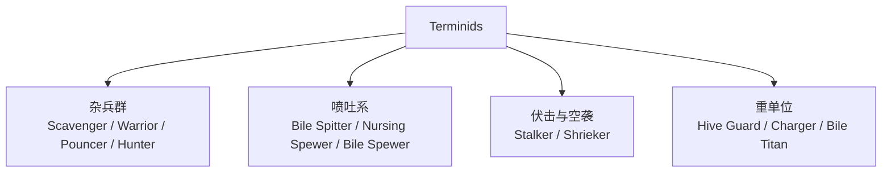
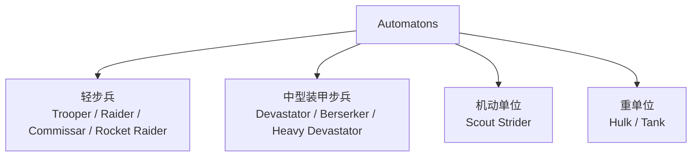
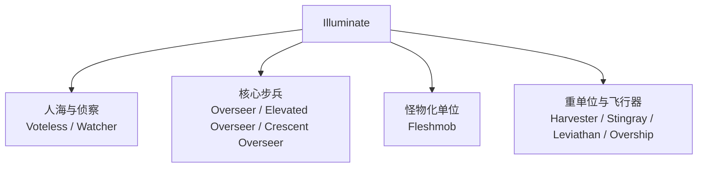

# Helldivers 2 三阵营敌人与弱点整理

数据快照日期：2026-04-26  
文档状态：`2026.04.26-r1 初稿，可持续补全`

_整理与维护：ResnowH_

> 时间说明：官方在 2026-02-10 的更新公告中已确认 `Cyborg` 作为 Automaton 战线下的新子派系回归。本文档当前以三大主阵营 `Terminids / Automatons / Illuminate` 为主轴整理，`Cyborg` 相关内容保留在机器人战线扩展条目中另行补录。

## 快速导航

- 基础索引：
  - `中文译名校对说明`
  - `阵营总览`
  - `阵营示意图`
- 数据索引：
  - `数值速查`
  - `武器数值与反重速查`
  - `手雷与状态效果速查`
  - `哨戒炮、炮座与机甲速查`
- 实战索引：
  - `实战整合速查表`
- 阵营分章：
  - `Terminids 终结族`
  - `Automatons 机器人`
  - `Illuminate 光能者`
- 附录：
  - `资料来源`

## 基础索引

## 中文译名校对说明

本版已查阅中文 Wiki 后重新校对译名。当前结论如下：

- `Terminids`：中文 Wiki 可见译名为 `终结族`。
- `Automatons`：中文社区存在 `机器人` 与 `生化人` 两种叫法；其中较新的中文维基页面正文可见 `机器人`，B 站 Wiki 导航栏可见 `生化人`。
- `Illuminate`：较新的中文维基页面正文可见译名 `光能者`。

因此，本文档当前统一采用：

- `Terminids = 终结族`
- `Automatons = 机器人`
- `Illuminate = 光能者`

说明：

- 阵营级译名按中文 Wiki 现有页面优先。
- 单位级译名本次已按中文 Wiki、中文社区图鉴、中文新闻稿常用写法完成一轮全面校对。
- 武器与战略配备译名按 `游戏内中文/官方中文 > 中文 Wiki > 中文社区高一致性用法` 的顺序取舍。
- 少数 2025-2026 新增单位在中文公开资料中仍未形成完全统一叫法，文中会直接标注 `中文资料未统一`，避免把单一社区写法误当成官方定名。

## 章节地图

文档结构如下：

1. `阵营总览` 和 `阵营示意图` 负责建立整体框架。
2. `数值速查` 负责回答“这单位到底有多硬”。
3. `武器数值与反重速查`、`手雷与状态效果速查`、`哨戒炮、炮座与机甲速查` 负责回答“我拿什么处理它”。
4. `实战整合速查表` 负责把敌人、武器、手雷和战略配备压成一页式结论。
5. 三个阵营分章保留逐单位说明，用于回查与后续补完。

## 阵营总览

| 阵营 | 作战风格 | 典型威胁 | 通用处理思路 |
| --- | --- | --- | --- |
| 终结族 | 近中距离集群冲锋、地面压迫 | 高速近战、喷吐、巨体压制 | 快速清杂兵，优先拆头部、口器、腹囊，重武器留给大型重甲单位 |
| 机器人 | 远程火力、装甲步兵、机械重单位 | 火箭、机炮、装甲正面 | 利用掩体，打头部、散热器、背部通风口，反甲武器专打重甲 |
| 光能者 | 护盾、高机动、城市战、肉盾海 | 护盾、心控杂兵、光束重单位 | 先破盾再点杀核心，控住监视者，重火力拆收割者腿部与关节 |

## 阵营示意图

### Terminids

### Automatons

### Illuminate

## 数据索引

### 数值速查

说明：

- 本节优先记录 `主生命值`、`关键弱点部位生命值`、`主装甲等级`、`特殊倍率/说明`。
- 数据主要来自 `helldivers.wiki.gg` 当前页面，页面显示的游戏版本为 `1.006.102`。
- 少数敌人会随难度改变生命值或装甲，表中已单独标出。
- 若某条目暂时只拿到主生命值而没有完整部位表，我会写成 `主生命已确认，部位待补`。

### 部位结构（Anatomy）与转伤逻辑速查

说明：

- `部位结构（Anatomy）` 表中的核心字段包括：`部位血量（Health）`、`装甲等级（AV）`、`耐久比例（Durable）`、`转伤主生命比例（% To Main）`、`溢出封顶（Overflow Cap）`、`致命判定（Fatal）`、`肢体生命/衰亡池（Constitution）`、`爆炸伤害抗性（ExDR）`。
- 这部分直接影响“为什么同样是 2000 伤害，打不同部位结果完全不同”。
- 实战判断通常围绕三个问题展开：
  1. 该部位能否被当前武器穿透。
  2. 该部位打掉后会不会高比例转伤主生命。
  3. 该部位本身是否致命，或者会不会触发额外衰亡。

#### 字段释义

| 中文术语 | 英文字段 | 实战意义 |
| --- | --- | --- |
| 部位血量 | `Health` | 决定该部位本身要承受多少伤害才会破坏。 |
| 装甲等级 | `AV` | 武器穿甲不足时，面板伤害再高也可能打不进去。 |
| 耐久比例 | `Durable` | 对高耐久部位时，更应参考武器的耐久伤害而不是标准伤害。 |
| 转伤主生命比例 | `% To Main` | 说明打该部位时，有多少伤害会同步结算到主生命。 |
| 溢出封顶 | `Overflow Cap` | 若为 `Yes`，转给主生命的伤害会受到该部位最大血量限制。 |
| 致命判定 | `Fatal` | 有些部位被摧毁后可直接击杀目标。 |
| 肢体生命/衰亡池 | `Constitution` | 某些肢体在主部位打空后还会继续维持一段时间，或开始衰亡。 |
| 爆炸伤害抗性 | `ExDR` | 决定爆炸伤害是否有效，以及能否靠爆炸绕过部位处理主血。 |

#### 通用结论

- `高转伤 + 可穿透 + 可稳定命中` 的部位，才是真正高价值弱点。
- `无甲软部位` 不一定就最好打；若其 `耐久比例（Durable）` 较高而武器耐久伤害很低，效率仍然可能很差。
- `致命判定（Fatal） = Yes` 的部位价值极高，但前提仍然是穿得进去、打得准。
- `肢体生命/衰亡池（Constitution）` 常见于大型单位的腿部或肢体，这也是某些目标“看起来腿断了却没立刻死”的原因。

### 关键单位部位结构（Anatomy）样例

#### 强袭虫（Charger）

| 部位 | 部位血量 | 装甲 | 耐久 | 转伤主生命 | 结论 |
| --- | --- | --- | --- | --- | --- |
| 头部 | 1200 | 重甲 | 75% | 70% | 典型高价值致命部位，适合反坦克直杀。 |
| 前部内层肉体 | 主血共享 | 无甲 II | 30% | 300% | 腿甲被拆后，这类肉体部位的转伤效率极高。 |
| 臀部 | 950 | 无甲 I | 80% | 150% | 适合打爆后触发流血与衰亡，但耐久高，低耐久伤害武器不划算。 |
| 后部装甲板 | 2200 | 重甲 | 75% | 75% | 血量高且重甲，不是优先输出点。 |

结论：

- `反坦克打头` 与 `拆腿甲后补肉腿` 是两条最稳定路径。
- `臀部` 虽然无甲，但属于高耐久软部位，更吃耐久伤害而不是标准伤害。

#### 吐酸泰坦（Bile Titan）

| 部位 | 部位血量 | 装甲 | 耐久 | 转伤主生命 | 结论 |
| --- | --- | --- | --- | --- | --- |
| 头部 | 1500 | 重甲 | 95% | 100% | 高价值致命部位，但需要高穿甲。 |
| 上腹囊 | 750 | 无甲 I | 100% | 100% | 破坏后可显著压低喷吐能力。 |
| 下腹囊 | 750 | 无甲 I | 100% | 100% | 与上腹囊类似，适合补伤与战术削弱。 |
| 下腹部 | 4000 | 轻甲 | 80% | 60% | 可作为持续输出位，但不如头部和腹囊高效。 |
| 后部装甲 | 3500 | 重甲 | 100% | 100% | 可受伤，但不属于理想输出位。 |

结论：

- `头部` 仍是最优直杀路径。
- `双腹囊` 的战术价值在于削弱喷吐与补转伤，而不是取代头部成为最高效率部位。

#### 蹂躏者（Devastator）

| 部位 | 部位血量 | 装甲 | 耐久 | 转伤主生命 | 结论 |
| --- | --- | --- | --- | --- | --- |
| 主生命 | 750 | 中甲 | 100% | - | 需要绕开中甲躯干处理。 |
| 头部 | 125 | 低甲弱点 | 0% | 100% | 极高价值弱点，精确命中可快速击杀。 |
| 躯干正面 | 中甲部位 | 中甲 | 高耐久 | 高转伤 | 理论可打，但效率显著低于爆头。 |

结论：

- 机器人中甲步兵的核心部位结构规律就是：`正面躯干能打，但不值得；头部更值。`

#### 收割者（Harvester）

| 部位 | 部位血量 | 装甲 | 耐久 | 转伤主生命 | 结论 |
| --- | --- | --- | --- | --- | --- |
| 受损底盘 | 2000 | 重甲 | 75% | 100% | 盾破后本体输出位。 |
| 内部组件 | 800 | 轻甲 | 50% | 100% | 破甲后极高收益。 |
| 上腿内部 | 1000 | 中甲 | 25% | 45% 至 60% | 适合持续拆腿。 |
| 下腿内部 | 1000 | 中甲 | 25% | 60% | 高效率拆腿位。 |

结论：

- 收割者的关键不是“只打主眼”，而是 `破盾后拆腿与内部结构`。
- `中甲腿部 + 低耐久比例` 使得机炮、重机枪、激光大炮这类持续武器非常有价值。

### 终结族数值

| 中文名 | 英文名 | 主生命值 | 关键部位生命值 | 主装甲 | 特殊说明 |
| --- | --- | --- | --- | --- | --- |
| 食腐虫 | Scavenger | 60 | 肢体 30 | 无甲 I | 低血量杂兵，任何武器都能轻松清理。 |
| 猛扑虫 | Pouncer | 60 | 页面主生命已确认，部位待补 | 无甲 | 极低韧性，跳扑威胁高于血量。 |
| 追猎虫 | Hunter | 130（中等及以下）/ 160（挑战及以上） | 头 40；爪 45/60；腿 45/60；翼 20 | 无甲 I | 难度提升后主生命与肢体血量上升。 |
| 武斗虫 | Warrior | 250（中等及以下）/ 325（挑战及以上） | 头 110/150；爪 75/100；腿 75/100 | 无甲 II | 腿部与头部都能高效转伤主血。 |
| 虫巢守卫 | Hive Guard | 500 | 头 250；前腿 125；后腿 125 | 主体轻甲；头/爪中甲 | 正面中甲是其难点，颈部缝隙与腿部仍可处理。 |
| 虫族指挥官 | Brood Commander | 800 | 头 200；爪 200；腿 170 | 轻甲 | 头部致命，但打腿更稳，且会高比例转伤主血。 |
| 护理喷涌虫 | Nursing Spewer | 750 | 口 250；脊板 500；臀囊 750 | 主体轻甲 | 口器与臀囊都可致命；臀囊高耐久但可造成大额转伤。 |
| 喷涌虫 | Bile Spewer | 750 | 头 300；口 250；脊板 500；臀囊 750 | 轻甲；极限难度主体/头部升为中甲 | 从极限难度开始，头部与主体更难被轻穿武器处理。 |
| 强袭虫 | Charger | 2400 | 头 600（页面变更记录已确认）；主生命 2400 | 重甲 | 腿甲被拆后肉腿更适合主武器补刀。 |
| 追踪虫 | Stalker | 800 | 头 175；翼 125 | 主体无甲 II；背甲轻甲 | 伪装时会回复约 50 生命/秒，拖延越久越难杀。 |
| 尖啸虫 | Shrieker | 80 | 头 30；肢体 30；翼 20 | 无甲 I | 血量很低，但俯冲与坠尸伤害危险。 |
| 吐酸泰坦 | Bile Titan | 6500 | 主生命已确认；部位表待补 | 重甲 | 火焰承伤 1.7 倍；口部和腹囊仍是实战重点。 |

### 机器人数值

| 中文名 | 英文名 | 主生命值 | 关键部位生命值 | 主装甲 | 特殊说明 |
| --- | --- | --- | --- | --- | --- |
| 装甲兵 | Trooper | 125 | 头 40；躯干 100；手臂 65；腿 90 | 无甲 I | 轻型机器人通用模板之一。 |
| 劫掠者 | Marauder | 125 | 主生命已确认，部位待补 | 轻甲化轻型单位 | 比装甲兵更耐打，但仍属于轻型。 |
| 政委 | Commissar | 125 | 头 40；躯干 100；手臂 65；腿 90 | 无甲 II | 页面明确说明：并非只有政委能叫空投，所有轻型机器人都可能打信号弹。 |
| 机枪奇袭者 | MG Raider | 125 | 主生命已确认，部位待补 | 轻型 | 背包爆炸可造成 130 爆炸伤害和 100/秒燃烧。 |
| 火箭奇袭者 | Rocket Raider | 125 | 主生命已确认，部位待补 | 轻型 | 火箭爆炸 70，直击 30。 |
| 特攻奇袭者 | Assault Raider | 125 | 主生命已确认，部位待补 | 轻型 | 喷气背包爆炸 130，并附带持续燃烧。 |
| 侦察纵步者 | Scout Strider | 500 | 驾驶员是实际弱点；机体主生命 500 | 重甲步行机 | 正面机体硬，但驾驶员暴露。 |
| 狂暴者 | Berserker | 750 | 主生命已确认，部位待补 | 中型 | 近战型中单位，主血与蹂躏者同级。 |
| 蹂躏者 | Devastator | 750 | 头部为关键弱点；完整部位表见页面 Anatomy | 中甲；头部轻甲/低甲弱点 | 火箭型、重型都沿用 750 主生命基线。 |
| 重型蹂躏者 | Heavy Devastator | 750 | 主生命已确认，头部关键弱点延续蹂躏者逻辑 | 中甲 | 正面大盾压制更烦，数值与普通蹂躏者接近。 |
| 火箭蹂躏者 | Rocket Devastator | 750 | 主生命已确认，头部关键弱点延续蹂躏者逻辑 | 中甲 | 主要威胁来自火箭齐射而不是血量差异。 |
| 强袭巨型者 | Hulk Bruiser | 1800 | 头部、背部散热器为关键弱点 | 重甲 | 火焰承伤 1.5 倍。 |
| 喷火巨型者 | Hulk Scorcher | 1800 | 头部、背部散热器为关键弱点 | 重甲 | 贴脸最危险的浩克变种之一。 |
| 歼灭巨型者 | Hulk Obliterator | 1800 | 头部、背部散热器为关键弱点 | 重甲 | 火箭双臂压制强，数值与其他浩克一致。 |
| 歼灭者坦克 | Annihilator Tank | 3000（车体）/ 2100（炮塔） | 炮塔散热器 750；引擎舱 750；履带 750 | 坦克 I | 后部中甲弱点位会高比例转伤主血，是最实用击杀口。 |

### 光能者数值

| 中文名 | 英文名 | 主生命值 | 关键部位生命值 | 主装甲 | 特殊说明 |
| --- | --- | --- | --- | --- | --- |
| 无票者 | Voteless | 100（轻）/ 130（中）/ 160（重） | 主生命分档已确认，部位待补 | 轻/中/重不同词条分档 | 不同体型/分档会改变主生命。 |
| 观察者 | Watcher | 600 | 核心/主体 400 | 主体无甲 I；核心/主体轻甲 | 会呼叫增援，数值不高但节奏威胁很大。 |
| 监视者 | Overseer | 600 | 主生命已确认，部位待补 | 轻甲配护盾 | 有盾，实际击杀门槛高于纸面主血。 |
| 崇高监视者 | Elevated Overseer | 450 | 主生命已确认，部位待补 | 中型 | 机动强，但主血低于普通监视者。 |
| 新月监视者 | Crescent Overseer | 600 | 主生命已确认，部位待补 | 中型 | 与普通监视者主血一致，定位偏火力压制。 |
| 收割者 | Harvester | 3000 | 眼部、髋关节、上下盾发生器为关键弱点 | 重型机械；带护盾 | 自带可再生护盾；任一盾发生器被拆即可永久失去护盾能力。 |
| 肉瘤体 | Fleshmob | 5000 | 上部头脸块会对主血转伤 150% | 无甲高肉度 | 当前页面变更记录确认主血已从 6000 下调到 5000。 |
| 刺魟 | Stingray | 800 | 主生命已确认，部位待补 | 飞行器 | 扫射前后速变化时最容易命中。 |
| 利维坦 | Leviathan | 15000 | 主炮塔、鳍片/尾部破坏后内部为关键弱点 | 坦克级飞行战舰 | 当前文档中主血最高的光能者常规单位之一。 |
| 运输飞船 | Illuminate Overship | 18001 | 发光港口 1500；护盾 10000 | 坦克 VI | `2026-03-17` 后主船体与港口已升至坦克 VI，常规任务中应按专用目标处理。 |
| 跃迁飞船 | Warp Ship | 3500 | 主船体/船壳 3500 | 坦克 I | 先破盾再打本体；本质上是投送与据点单位。 |
| 守门人 | Gatekeeper | 2500 | 驾驶舱连接侧、顶部盾发生器为关键弱点 | 重型构装体 | wiki.gg 页面仍在完善中，但主血已给出。 |
| 入侵者 | Obtruder | 400 | 主生命已确认，部位待补 | 轻型飞行目标 | 观察者分支的攻击型变种。 |
| 裁验者 | Veracitor | 3000 | 驾驶舱连接侧、顶部眼部、腿部、发光排气区 | 重型构装体 | 近战型构装体，血量与收割者同级。 |

### 武器数值与反重速查

说明：

- 本节按 `反重`、`精确拆弱点`、`通用中穿`、`爆炸清群` 分类补充武器伤害。
- 数据以 `1.006.102` 版本下的 `wiki.gg` 页面为主。
- 武器中文名优先采用中文 Wiki 与中文社区高一致性叫法；英文名保留用于检索。
- 若某个武器的中文名在公开资料里仍存在分歧，我会保留英文名并在中文列使用 `常用译名`，而不会把它写成“唯一正确”的官方名。
- 数值优先记录 `标准伤害`、`耐久伤害`、`穿甲等级`；若武器自带爆炸，会拆开写。
- 实战击杀并不只看主生命值，还要看 `装甲等级`、`部位耐久`、`是否为致命部位`。例如：`浩克头部只有 250 生命，但要先打穿重甲弱点位。`

### 伤害判读规则

- `标准伤害`：打普通部位时的基础伤害。
- `耐久伤害`：打高耐久部位时更接近真实结算的伤害，例如 `强袭虫臀囊`、`喷涌虫臀囊`、部分飞行器本体。
- `穿甲等级`：决定武器能否有效穿透目标装甲。
- 反重武器的真正优势，往往不是面板伤害更高，而是 `高穿甲 + 高耐久伤害 + 能稳定命中致命弱点`。

### A. 反重主力武器

| 中文名 | 英文名 | 类型 | 标准伤害 | 耐久伤害 | 穿甲 | 备注 |
| --- | --- | --- | --- | --- | --- | --- |
| 飞矛 | FAF-14 Spear | 锁定反坦克 | 4000 投射物 + 200 爆炸 | 4000 + 200 | `反坦克 III（Anti-Tank III）` | 当前主流单发伤害最高之一；必须锁定。 |
| 无后坐力炮 | GR-8 Recoilless Rifle | 无后坐力炮反坦克弹 | 3200 投射物 + 150 爆炸 | 3200 + 150 | `反坦克 II（Anti-Tank II）` | 对重甲最稳定；多数重单位可一发处决弱点。 |
| 消耗性反坦克武器 | EAT-17 Expendable Anti-Tank | 一次性反坦克 | 2000 投射物 + 150 爆炸 | 约同值 | `反坦克 II（Anti-Tank II）` | 冷却极短，属于“中档伤害、极高灵活性”。 |
| 类星体加农炮 | LAS-99 Quasar Cannon | 蓄力反坦克 | 2000 投射物 + 150 爆炸 | 2000 + 150 | `反坦克 II（Anti-Tank II）` | 与 EAT 同伤害档，但无限弹；代价是 3 秒蓄力和约 15 秒冷却。 |
| 突击兵（Commando，常用译名） | MLS-4X Commando | 四联制导/直射导弹 | 1100 投射物 + 150 爆炸 | 1100 + 150 | `反坦克 II（Anti-Tank II）` | 单发低于 EAT / Quasar，但一筒四发，容错高。 |
| 磁轨炮（安全模式） | RS-422 Railgun | 精确反甲 | 600 | 225 | `反坦克 I（Anti-Tank I）` | 主打“高穿甲精确拆部件”，不是纯粹大数字爆发。 |
| 磁轨炮（过充模式） | RS-422 Railgun | 精确反甲 | 最高 1500 | 最高 562.5 | `反坦克 I（Anti-Tank I）` | 满充伤害提升到 2.5 倍，适合一枪拆致命弱点。 |

### B. 反重副主力与弱点拆解武器

| 中文名 | 英文名 | 类型 | 标准伤害 | 耐久伤害 | 穿甲 | 备注 |
| --- | --- | --- | --- | --- | --- | --- |
| 反器材步枪 | APW-1 Anti-Materiel Rifle | 反器材步枪 | 450 | 225 | `重穿（Heavy）` | 适合打 `浩克头`、`炮塔弱点`、`飞行器推进器`。 |
| 机炮 | AC-8 Autocannon | 机炮 | 325 投射物 + 150 爆炸 | 页面已确认重甲穿透；耐久细值待补 | `重穿（Heavy）` | 多用途强，兼顾中甲、炮塔、飞行器、弱点拆解。 |
| 重机枪 | MG-206 Heavy Machine Gun | 重机枪 | 150 | 35 | `重穿（Heavy）` | 纸面单发不高，但持续火力强；对 `收割者腿`、`中甲步兵` 很实用。 |
| 激光大炮 | LAS-98 Laser Cannon | 激光炮 | 350 DPS 激光 + 100 DPS 火焰 | 页面主值已确认，耐久细值待补 | `重穿（Heavy）` | 长时间稳定照射，适合持续烧穿中重目标部位。 |
| 电弧发射器 | ARC-3 Arc Thrower | 电弧投射器 | 250 | 页面待补 | `反坦克 III（Anti-Tank III）` | 穿甲极高，但依赖连锁与命中逻辑，适合作为特殊用途武器。 |
| 火焰喷射器 | FLAM-40 Flamethrower | 火焰喷射器 | 喷流 2/跳 + 点燃 100/秒 | 2 + 100/秒 | `重穿（Heavy）` | 对火焰弱点敌人很强，尤其是终结族大型单位。 |

### C. 通用中穿主武器

| 中文名 | 英文名 | 类型 | 标准伤害 | 耐久伤害 | 穿甲 | 用途定位 |
| --- | --- | --- | --- | --- | --- | --- |
| 主宰 | JAR-5 Dominator | 主武器 | 275 | 页面待补 | `中穿（Medium）` | 打机器人中甲步兵、光能者监视者很稳。 |
| 惩罚者独头弹 | SG-8S Slugger | 独头弹霰弹 | 330 | 页面待补 | `中穿（Medium）` | 近中距离精确拆中甲部位。 |
| 焦土 | PLAS-1 Scorcher | 等离子步枪 | 100 投射物 + 100 爆炸 | 50 + 100 | `轻穿（Light）+ 中穿爆炸（Medium）` | 对飞行器推进器、轻中甲弱点和群体都很灵活。 |
| 爆裂铳 | R-36 Eruptor | 爆炸步枪 | 230 投射物 + 225 爆炸 | 页面待补 | `重穿投射物（Heavy）/ 中穿爆炸（Medium）` | 主武器里最接近“轻型反甲”的选择之一。 |
| 爆炸十字弩 | CB-9 Exploding Crossbow | 爆炸弩 | 270 投射物 + 350 爆炸 | 50 + 350 | `中穿（Medium）` | 单发爆炸收益很高，适合拆聚堆中甲与软弱点。 |

### D. 爆炸清群与软部位压制

| 中文名 | 英文名 | 类型 | 标准伤害 | 耐久伤害 | 穿甲 | 用途定位 |
| --- | --- | --- | --- | --- | --- | --- |
| 榴弹发射器 | GL-21 Grenade Launcher | 榴弹发射器 | 400 爆炸 | 400 | `中穿（Medium）` | 对高耐久软部位特别有效，例如喷涌虫、强袭虫臀囊。 |
| 空爆火箭发射器 | RL-77 Airburst Rocket Launcher | 空爆火箭 | 350 投射物 + 150 爆炸；子炸弹 150 + 500x25 | 以爆炸为主 | `中穿（Medium）` | 反群极强，能炸死 `肉瘤体`，但不适合作为纯反重主武器。 |
| 机枪 | MG-43 Machine Gun | 机枪 | 90 | 23 | `中穿（Medium）` | 主要是反群和压制，不是反重解法。 |

### 反重阈值速读

以下判断建立在“命中有效弱点或致命部位”的前提下：

- `浩克头部` 只有 `250` 生命。
  - `反器材步枪（AMR）450` 可一枪头。
  - `磁轨炮（Railgun）` 安全模式就足够一枪头。
  - `消耗性反坦克武器（EAT）/ 类星体加农炮（Quasar）/ 无后坐力炮（RR）/ 飞矛（Spear）` 都是一发直接带走整只浩克。
- `收割者` 主生命 `3000`，但实战应优先拆 `腿部关节` 或 `盾发生器`。
  - `无后坐力炮（RR）` 一发 3200 理论上已够主血，但护盾与命中部位决定实际效率。
  - `消耗性反坦克武器（EAT）/ 类星体加农炮（Quasar）` 属于两发档主力。
  - `突击兵（Commando）` 通常需要多发持续命中关键部位。
  - `重机枪（HMG）/ 激光大炮（Laser Cannon）` 更像“持续拆腿”而不是瞬杀。
- `强袭虫` 主生命 `2400`。
  - `无后坐力炮（RR）` 对头部属于稳定一发档。
  - `消耗性反坦克武器（EAT）/ 类星体加农炮（Quasar）` 常见为一发头杀或一发拆腿甲后补枪，取决于命中点。
  - `磁轨炮（Railgun）` 适合打弱点，不适合单纯灌主体。
- `吐酸泰坦` 主生命 `6500`。
  - `飞矛（Spear）4000` 与 `无后坐力炮（RR）3200` 是最接近“高效处决”的档位。
  - `消耗性反坦克武器（EAT）/ 类星体加农炮（Quasar）2000` 更多是多发配合或打口部/腹囊。
  - `突击兵（Commando）` 更偏持续压血，不是最优单兵秒杀手段。

### 推荐分类

#### 1. 纯反重首选

- `飞矛`
- `无后坐力炮`
- `消耗性反坦克武器`
- `类星体加农炮`

#### 2. 精确拆弱点首选

- `磁轨炮`
- `反器材步枪`
- `机炮`

#### 3. 持续压制型反重/反中甲

- `重机枪`
- `激光大炮`
- `火焰喷射器`

#### 4. 主武器里可兼顾硬目标

- `主宰`
- `焦土`
- `爆裂铳`
- `爆炸十字弩`

### 选武器的实战逻辑

- 处理 `单个超重单位` 时，优先选 `飞矛 / 无后坐力炮 / 消耗性反坦克武器 / 类星体加农炮`。
- 处理 `重单位弱点` 时，优先选 `磁轨炮 / 反器材步枪 / 机炮`。
- 处理 `中甲步兵 + 偶发重甲` 的混编时，优先选 `重机枪 / 激光大炮 / 机炮`。
- 处理 `终结族大量高耐久软部位` 时，`榴弹发射器` 和火焰武器通常比纯弹道更划算。

### 反重武器操作数据

| 中文名 | 英文名 | 供弹/冷却特征 | 操作成本 | 实战定位 |
| --- | --- | --- | --- | --- |
| 飞矛 | FAF-14 Spear | 背包供弹，需锁定 | 高 | 最强单发，但最吃视野、锁定窗口与地形。 |
| 无后坐力炮 | GR-8 Recoilless Rifle | 背包供弹，可队友协助装填 | 中高 | 最稳的反重主武器，适合持续处理多只重甲。 |
| 消耗性反坦克武器 | EAT-17 Expendable Anti-Tank | 单次部署双发，冷却短 | 低 | 最灵活的反重补位手段，适合随叫随打。 |
| 类星体加农炮 | LAS-99 Quasar Cannon | 无限弹，约 15 秒冷却，3 秒蓄力 | 中 | 省补给，但节奏慢，适合有掩体和换位空间的局面。 |
| 突击兵（Commando，常用译名） | MLS-4X Commando | 一筒四发，手持即用 | 低中 | 多发容错型反重，适合连续拆部件。 |
| 磁轨炮 | RS-422 Railgun | 单发装填，蓄力输出 | 中高 | 不靠爆炸，而靠精确高穿甲拆头、拆腿、拆核心。 |
| 机炮 | AC-8 Autocannon | 背包供弹，双联装填 | 中 | 反中甲与拆弱点全能，但对最厚的重甲不如纯反坦克。 |
| 反器材步枪 | APW-1 Anti-Materiel Rifle | 弹匣供弹 | 低 | 处理机器人头部弱点、炮塔和飞行器部件效率很高。 |
| 重机枪 | MG-206 Heavy Machine Gun | 弹链供弹，后坐力高 | 中 | 持续拆腿、拆中甲、压制混编敌群。 |
| 激光大炮 | LAS-98 Laser Cannon | 持续照射，过热管理 | 中 | 适合稳定烧部件，不适合抢瞬间爆发。 |

### 重单位理论击杀档位

说明：

- 下表是 `理论档位`，前提是命中有效弱点或关键部位。
- `一发档 / 两发档 / 多发档` 用于快速判断武器优先级，不等于任何角度都成立。
- 对带护盾的光能者单位，默认先算“破盾后本体”效率。

| 目标 | 主血/关键数据 | 飞矛 | 无后坐力炮 | 消耗性反坦克武器 / 类星体加农炮 | 突击兵（Commando） | 磁轨炮 | 反器材步枪 / 机炮 |
| --- | --- | --- | --- | --- | --- | --- | --- |
| 强袭虫 | 主血 2400；头部为核心弱点 | 一发档 | 一发档 | 一发头杀或拆腿甲后补枪 | 多发拆腿档 | 弱点拆解档 | 机炮可拆腿与补伤；反器材步枪（AMR）不适合主体硬灌 |
| 吐酸泰坦 | 主血 6500；口部/腹囊高收益 | 两发内高效档 | 两发内高效档 | 多发档 | 持续压血档 | 不推荐当主解 | 机炮偏补伤；反器材步枪（AMR）不推荐 |
| 巨型者 | 头 250；背散热器为致命弱点 | 一发档 | 一发档 | 一发档 | 两发以上稳妥档 | 一枪头档 | 反器材步枪（AMR）一枪头；机炮高效 |
| 歼灭者坦克 | 车体 3000；炮塔 2100；散热器 750 | 一发弱点档 | 一发弱点档 | 两发档 | 多发档 | 弱点拆解档 | 机炮打后部效率高；反器材步枪（AMR）主要打弱点 |
| 侦察纵步者 | 机体 500；驾驶员暴露 | 纯属过杀 | 纯属过杀 | 纯属过杀 | 可用但浪费 | 可用但浪费 | 反器材步枪（AMR）/ 机炮 / 主武器点驾驶员最优 |
| 收割者 | 主血 3000；腿、眼、盾发生器关键 | 一发到两发高效档 | 一发到两发高效档 | 两发档 | 多发持续拆件档 | 弱点拆解档 | 机炮 / 重机枪（HMG）/ 激光大炮（Laser Cannon）拆腿很强；反器材步枪（AMR）偏拆弱点 |
| 利维坦 | 主血 15000；主炮和内部结构高收益 | 高效反舰档 | 多发高效档 | 多发档 | 多发档 | 不推荐 | 机炮偏拆炮塔，不是主杀伤手段 |
| 跃迁飞船 | 主血 3500；需先破盾 | 一发到两发档 | 两发档 | 两发档 | 多发档 | 不推荐 | 机炮偏补伤，不适合当主解 |
| 守门人 | 主血 2500；驾驶舱连接位关键 | 一发到两发档 | 一发到两发档 | 两发档 | 多发档 | 弱点拆解档 | 机炮 / 反器材步枪（AMR）适合拆驾驶舱连接位 |
| 裁验者 | 主血 3000；驾驶舱连接位、腿部关键 | 一发到两发档 | 一发到两发档 | 两发档 | 多发档 | 弱点拆解档 | 机炮、重机枪、激光大炮拆腿收益高 |

### 对应推荐

| 场景 | 最稳选择 | 次优选择 | 不推荐思路 |
| --- | --- | --- | --- |
| 单只超重单位速杀 | 飞矛、无后坐力炮 | 消耗性反坦克武器、类星体加农炮 | 用中穿主武器硬磨主体 |
| 多只重甲连续刷新 | 无后坐力炮、消耗性反坦克武器 | 类星体加农炮、突击兵（Commando） | 只带单发高爆且缺续航 |
| 机器人弱点拆解 | 反器材步枪、机炮、磁轨炮 | 重机枪 | 纯火焰流 |
| 光能者拆腿/拆盾发生器 | 机炮、重机枪、激光大炮 | 磁轨炮、突击兵（Commando） | 只打护盾表面 |
| 终结族高耐久软部位 | 榴弹发射器、火焰喷射器 | 机炮、类星体加农炮 | 只靠低耐久伤害弹道武器 |

### 手雷与状态效果速查

说明：

- 这一节重点回答三个问题：`能不能控住`、`能不能炸建筑`、`对重单位值不值得带`。
- 数值依旧优先采用 `wiki.gg` 当前页面。
- 实战里，手雷的价值常常不在“总伤害”，而在 `拆建筑`、`打断动作`、`补最后一段伤害`。

### A. 常见手雷面板

| 中文名 | 英文名 | 伤害/效果 | 穿甲 | 引信 | 容量 | 核心定位 |
| --- | --- | --- | --- | --- | --- | --- |
| 高爆手雷 | G-12 High Explosive | 800 爆炸 | `重穿（Heavy）` | 3.5 秒，可预热 | 4 | 面板最高的常规爆炸手雷，兼顾反甲与炸建筑。 |
| 破片手雷 | G-6 Frag | 500 爆炸 + 110 破片 x35 | `中穿（Medium）` | 2.4 秒，可预热 | 6 | 大范围清群，反人群优于反重。 |
| 冲击手雷 | G-16 Impact | 400 爆炸 | `重穿（Heavy）` | 碰撞起爆 | 4 | 即时起爆，适合快速补刀和瞬间炸洞。 |
| 燃烧手雷 | G-10 Incendiary | 300 爆炸 + 100 火焰/秒 | 爆炸 `中穿（Medium）`；火焰 `重穿（Heavy）` | 2.9 秒，可预热 | 4 | 堵口、守路、烧终结族和无票者非常强。 |
| 燃烧冲击手雷 | G-13 Incendiary Impact | 150 爆炸 + 100 火焰/秒 | 爆炸 `中穿（Medium）`；火焰 `重穿（Heavy）` | 碰撞起爆 | 4 | 更适合中近距离立刻点燃小群敌人。 |
| 毒气手雷 | G-4 Gas | 3 爆炸 + 25 毒气/秒 + 混乱 | `反坦克 II（Anti-Tank II）` | 2.9 秒，可预热 | 4 | 控场型手雷，可致盲、减速、打乱路径。 |
| 眩晕手雷 | G-23 Stun | 0 伤害；5 秒眩晕 | `反坦克 II（Anti-Tank II）` | 1.8 秒，可预热 | 4 | 最强控制手雷之一，专门给弱点输出和战略配备创造窗口。 |
| 铝热手雷 | G-123 Thermite | 150 火焰/秒 x 6.5 秒 + 2000 爆炸 | `坦克 III（Tank III）` | 2.9 秒，可预热；黏附 | 3 | 手雷里的纯反重首选，对单体重甲最强。 |
| 追猎手雷 | G-50 Seeker | 500 爆炸 | `重穿（Heavy）` | 自动索敌后碰撞起爆 | 4 | 会追目标，适合打移动目标和高角度弱点。 |

### B. 建筑与据点处理

| 手雷 | 能否炸虫洞/工厂/跃迁飞船 | 备注 |
| --- | --- | --- |
| 高爆手雷 | 能 | 最稳的常规炸洞手雷之一。 |
| 冲击手雷 | 能，但更吃落点 | 不能掉进洞里后再爆，必须直接扔到合适位置。 |
| 燃烧手雷 | 能 | 兼顾炸洞和封路。 |
| 燃烧冲击手雷 | 能，但更吃精准投掷 | 由于碰撞即爆，容错低于定时手雷。 |
| 毒气手雷 | 能 | `Demolition Force 30`，同时还能留毒云控场。 |
| 眩晕手雷 | 不能 | 纯控制，无结构破坏能力。 |
| 铝热手雷 | 不推荐拿来炸洞 | 更该留给重甲单位。 |
| 追猎手雷 | 不适合炸洞 | 更偏追踪单体目标。 |

### C. 对三阵营的实战价值

| 手雷/状态 | 终结族 | 机器人 | 光能者 |
| --- | --- | --- | --- |
| 高爆手雷 | 对强袭虫绕后补刀、炸洞都强 | 能补中甲和炸工厂 | 可补收割者腿部与群体步兵 |
| 冲击手雷 | 杀喷涌虫、尖啸虫群很快 | 快速炸炮塔弱点、补坦克后部 | 适合瞬间补监视者和观察者 |
| 燃烧手雷 | 对虫群、无票者、肉瘤体非常强 | 对重甲一般，但能烧轻中步兵 | 对无票者和近身光能步兵很强 |
| 毒气手雷 | 强控虫群推进 | 打乱轻型机器人射击和路径 | 对无票者、观察者、监视者群有很高控场价值 |
| 眩晕手雷 | 可控住强袭虫、喷涌虫、指挥官 | 可控住巨型者、蹂躏者、纵步者等大量单位 | 可控住收割者、监视者、观察者等关键目标 |
| 铝热手雷 | 对强袭虫、吐酸泰坦都很值 | 对巨型者、坦克、炮塔都强 | 对收割者、守门人、裁验者等重单位最值 |
| 追猎手雷 | 适合补移动重伤目标 | 可追中距离机器人小队或炮塔弱点 | 对飞行和机动单位比普通手雷更容易命中 |

### D. 眩晕、毒气、火焰的关键判定

#### 眩晕

- `G-23 眩晕手雷` 的控制时间是 `5 秒`。
- 它可以打断大多数敌人的当前动作，为爆头、拆腿、丢轨道精准攻击创造窗口。
- 明确无效或不再有效的重点目标：
  - `吐酸泰坦` 不再能被眩晕。
  - `机器人坦克` 不会被眩晕。
  - `工厂阔步者` 不会被眩晕。

#### 毒气

- `G-4 毒气手雷` 的毒云持续 `15 秒`，毒气伤害为 `25/秒`。
- 它会同时附加 `Gas` 与 `Gas Confusion`，让敌人失去目标、乱走、盲打。
- 毒气不擅长秒杀重甲，但非常擅长：
  - 拖慢终结族推进。
  - 打乱机器人轻步兵火力线。
  - 压制光能者无票者和步兵群。
- 毒气可以和火焰同时存在，适合混合控场。

#### 火焰

- `G-10` 与 `G-13` 的持续火焰伤害都是 `100/秒`。
- 火焰对 `终结族` 与 `无票者` 效果尤其好，因为这类目标更容易长期停留在火区里。
- 火焰不是处理机器人厚甲本体的首选，但对机器人轻中步兵和背包单位仍有价值。

### E. 手雷选择

| 需求 | 最优先选择 | 次优选择 |
| --- | --- | --- |
| 纯反重 | 铝热手雷 | 高爆手雷、冲击手雷 |
| 通用炸建筑 | 高爆手雷 | 冲击手雷、毒气手雷、燃烧手雷 |
| 纯控制 | 眩晕手雷 | 毒气手雷 |
| 守路/封口 | 燃烧手雷 | 燃烧冲击手雷、毒气手雷 |
| 清群 | 破片手雷 | 燃烧手雷、燃烧冲击手雷 |
| 打移动目标 | 追猎手雷 | 冲击手雷 |

### F. 当前结论

- `铝热手雷` 是手雷栏位里的 `纯反重最优解`。
- `眩晕手雷` 不是输出手雷，但它常常能换来全队最高的总输出收益。
- `毒气手雷` 的强项不是伤害，而是 `破坏敌人节奏`。
- `高爆手雷` 仍然是最稳的泛用型爆炸手雷。
- `燃烧手雷` 在终结族和无票者战场的价值显著高于机器人战场。

### 哨戒炮、炮座与机甲速查

说明：

- 本节优先整理 `能长期压制重单位` 的防御型战略配备。
- 中文名采用中文社区高一致性写法；若后续查到更明确的官方中文，会再统一修正。
- 这里的重点不是单发爆发，而是 `持续输出`、`压制能力`、`目标优先级` 与 `部署条件`。

### A. 哨戒炮面板

| 中文名 | 英文名 | 标准伤害 | 穿甲 | 供弹 | 冷却 | 关键特征 |
| --- | --- | --- | --- | --- | --- | --- |
| 机枪哨戒炮 | A/MG-43 Machine Gun Sentry | 80 弹道 | `轻穿（Light）` | 150 | 90 秒 | 最基础反群哨戒炮，主要负责清杂而非反重。 |
| 加特林哨戒炮 | A/G-16 Gatling Sentry | 90 弹道 | `中穿（Medium）` | 500 | 150 秒 | 高射速压制，适合清轻中型目标，但不该当主反重。 |
| 机炮哨戒炮 | A/AC-8 Autocannon Sentry | 450 弹道 + 150 爆炸 | `反坦克 I（Anti-Tank I）` | 24，升级后 36 | 150 秒 | 三连发高爆反甲壳，对单体重目标 DPS 极高。 |
| 火箭哨戒炮 | A/MLS-4X Rocket Sentry | 单发火箭伤害高于机炮单发；爆炸为中穿 | `反坦克 I（Anti-Tank I）` | 页面主面板已确认，细分弹量待补 | 150 秒 | 超远射程，偏重型目标优先，持续反重能力强。 |
| 迫击炮哨戒炮 | A/M-12 Mortar Sentry | 爆炸伤害为主 | 爆炸中穿 | 页面主面板待补 | 180 秒 | 远程曲射压制，不适合近战混战区。 |
| 特斯拉塔 | A/ARC-3 Tesla Tower | 电击伤害为主 | 高穿甲电击 | 无传统弹药 | 150 秒 | 控区能力强，但误伤风险也极高。 |

### B. 炮座与机甲面板

| 中文名 | 英文名 | 标准伤害 | 穿甲 | 供弹 | 冷却 | 关键特征 |
| --- | --- | --- | --- | --- | --- | --- |
| 重机枪炮座 | E/MG-101 HMG Emplacement | 200 弹道；耐久伤害 40 | `重穿（Heavy）` | 300 | 180 秒 | 人工控制，持续火力极强，适合守线与拆中重目标部件。 |
| 反坦克炮座 | E/AT-12 Anti-Tank Emplacement | 1300 弹道 + 150 爆炸；耐久伤害同 1300 | `反坦克 II（Anti-Tank II）` | 30 | 180 秒 | 人工控制的高速反坦克炮，能稳定处理绝大多数重甲。 |
| 解放者机甲 | EXO-49 Emancipator Exosuit | 双机炮单发 300；耐久伤害 150；爆炸 150 | `反坦克 I（Anti-Tank I）` | 每臂 100 发 | 600 秒 | 持续拆件、拆腿和处理中重混编目标的综合能力最强。 |
| 爱国者机甲 | EXO-45 Patriot Exosuit | 火箭 + 机枪混合武装；细分伤害待补 | 火箭具反重能力 | 14 枚火箭；机枪 1350 发 | 600 秒 | 更偏综合压制与反群，火箭用于关键反重。 |

### C. 反重定位

| 装备 | 对单只重单位 | 对多只重单位 | 对混编敌群 | 主要短板 |
| --- | --- | --- | --- | --- |
| 机枪哨戒炮 | 弱 | 弱 | 中 | 穿甲不足，无法稳定处理重甲。 |
| 加特林哨戒炮 | 弱 | 弱 | 强 | 主要任务是清杂和压制，不是主反重。 |
| 机炮哨戒炮 | 很强 | 中 | 中 | 转向慢，贴脸目标会让它自爆或空转。 |
| 火箭哨戒炮 | 强 | 强 | 中 | 存在最小射程，近身敌人会让它停火。 |
| 迫击炮哨戒炮 | 中 | 中 | 强 | 友伤风险高，不适合狭窄近战区。 |
| 特斯拉塔 | 中 | 中 | 强 | 误伤最严重，部署位置要求高。 |
| 重机枪炮座 | 中 | 强 | 很强 | 需要人工持续操作，且旋转慢。 |
| 反坦克炮座 | 很强 | 很强 | 弱 | 非常吃射界和队友保护。 |
| 解放者机甲 | 强 | 强 | 很强 | 冷却长，体积大，怕被围。 |
| 爱国者机甲 | 中 | 中 | 很强 | 火箭总量有限，长期反重不如解放者。 |

### D. 关键结论

- `机炮哨戒炮` 是自动哨戒炮里对单体重目标最凶的一种，适合打 `吐酸泰坦 / 工厂阔步者 / 收割者 / 巨型者`。
- `火箭哨戒炮` 的总寿命输出和远距离反重能力非常强，尤其适合机器人战场。
- `重机枪炮座` 不是纯反坦克装备，但它对 `收割者腿部`、`机器人中甲群`、`光能者中重混编` 的持续压制非常强。
- `反坦克炮座` 是“固定版无后坐力炮机枪化”，只要射界够好，处理重甲效率极高。
- `解放者机甲` 是目前最适合连续拆多个重目标部件的平台之一。

### E. 部署要点

| 场景 | 推荐装备 | 原因 |
| --- | --- | --- |
| 开阔地对抗大型重单位 | 机炮哨戒炮、反坦克炮座 | 射界好时收益最高。 |
| 机器人远程火力线 | 火箭哨戒炮、重机枪炮座 | 一个负责远程反重，一个负责稳定清中甲。 |
| 终结族潮水推进 | 加特林哨戒炮、机枪哨戒炮、解放者机甲 | 先清杂再打大体型。 |
| 光能者城市战 | 重机枪炮座、机炮哨戒炮、解放者机甲 | 更需要可控持续火力和拆腿能力。 |
| 防守目标点 | 机炮哨戒炮 + 眩晕手雷 / 毒气手雷 | 控住小怪，给哨戒炮制造稳定输出窗口。 |

### 建筑与据点速查

说明：

- 本节优先采用中文页面和中文社区高一致性称呼。
- 部分目标在中文公开资料中的专有名词仍不完全统一，表内统一以便于检索和理解为原则。
- 这一节关注的是 `能否摧毁`、`推荐手段`、`处理优先级`，而不是完整任务流程。

| 目标 | 常用中文称呼 | 是否可由手雷破坏 | 推荐主手段 | 补充说明 |
| --- | --- | --- | --- | --- |
| 虫洞（Terminid Bug Hole） | 虫洞 / 虫巢洞口 | 可以 | 高爆手雷、冲击手雷、燃烧手雷、榴弹发射器、爆炸类主武器 | 冲击手雷更吃落点；定时爆炸物容错更高。 |
| 机器人工厂（Automaton Fabricator） | 机器人工厂 / 兵工厂 | 可以 | 高爆手雷、冲击手雷、榴弹发射器、机炮、反坦克武器 | 角度与开口位置比纯伤害更重要。 |
| 跃迁飞船（Illuminate Warp Ship） | 跃迁飞船 | 不建议依赖手雷 | 无后坐力炮、类星体加农炮、飞矛、轨道精准攻击、飞鹰500KG炸弹 | 通常先处理护盾，再处理船体。 |
| 炮塔（Automaton Cannon Turret） | 炮塔 / 加农炮塔 | 不推荐手雷 | 反器材步枪、机炮、无后坐力炮、轨道精准攻击 | 后部弱点是高收益命中区。 |
| 探测塔（Detector Tower） | 探测塔 | 不推荐手雷 | 轨道精准攻击、500KG 炸弹、反坦克武器 | 优先级高，属于典型应尽快清除的据点目标。 |
| 战略配备干扰器（Stratagem Jammer） | 战略配备干扰器 | 不能简单依赖手雷 | 终端解除或重火力拆毁关联结构 | 与其他据点不同，处理方式更依赖任务结构。 |
| 超级地球武装部队地对空导弹基地（SEAF SAM Site） | 超级地球武装部队地对空导弹基地 | 不属于破坏类目标 | 激活为主 | 中文页已明确该目标只会出现在机器人或光能者星球。 |
| 超级地球武装部队大炮（SEAF Artillery） | 超级地球武装部队大炮 | 不属于破坏类目标 | 激活与装填为主 | 属于可解锁支援战略配备的可选目标。 |

### 据点破坏方式总结

- `虫洞` 与 `机器人工厂` 都属于优先记忆“可投掷爆炸物封口”的目标。
- `跃迁飞船` 属于更偏重甲建筑的目标，处理逻辑接近重型载具而不是普通据点口。
- `探测塔` 和 `干扰器` 这类目标的威胁在于战术影响，不只是它们本身的血量。
- `超级地球武装部队地对空导弹基地` 与 `超级地球武装部队大炮` 属于功能型目标，重点在激活与利用，不在破坏。

## 实战索引

### 任务场景速查

说明：

- 本节按 `地形`、`任务节奏`、`敌群构成` 归纳常见场景差异。
- 重点不是给出唯一配装，而是归纳在该场景下更稳定的工具类型。
- 场景条目优先服务于高难度与混编局面。

| 场景 | 主要威胁 | 更稳定的装备类型 | 不利选择 | 说明 |
| --- | --- | --- | --- | --- |
| 城市战 | 遮挡多、近距离遭遇多、光能者护盾与无票者海 | 重机枪、机炮、毒气手雷、眩晕手雷、机炮哨戒炮 | 过度依赖超远程单发反坦克 | 城市环境更看重转角处理、持续压制和控场，而不是极远距离狙杀。 |
| 开阔地 | 远程火力线、坦克、巨型者、利维坦、吐酸泰坦 | 飞矛、无后坐力炮、类星体加农炮、反坦克炮座、火箭哨戒炮 | 纯近战处理思路 | 射界越大，反甲与防空武器的收益越高。 |
| 防守目标点 | 连续刷新、混编敌群、需要守住单一点位 | 机炮哨戒炮、加特林哨戒炮、毒气手雷、燃烧手雷、轨道激光炮 | 只带单体秒杀工具 | 防守场景优先考虑持续火力和范围压制。 |
| 进攻据点 | 炮塔、探测塔、干扰器、机器人工厂、跃迁飞船 | 轨道精准攻击、飞鹰500KG炸弹、无后坐力炮、高爆手雷、冲击手雷 | 只带对步兵轻武器 | 据点战重在快速清除高价值结构与火力源。 |
| 终结族潮水战 | 杂兵密度高、喷涌虫与强袭虫夹击 | 榴弹发射器、火焰喷射器、加特林哨戒炮、铝热手雷 | 低持续火力配装 | 终结族场景优先清潮，再处理重甲。 |
| 机器人火力线 | 火箭单位、中甲步兵、炮塔、坦克 | 主宰、焦土、反器材步枪、机炮、眩晕手雷、重机枪炮座 | 纯火焰流 | 掩体利用、爆头能力和弱点拆解效率最关键。 |
| 光能者混编战 | 护盾、无票者海、收割者、飞行器、构装体 | 机炮、重机枪、激光大炮、毒气手雷、眩晕手雷、火箭哨戒炮 | 只打护盾表面 | 需要兼顾破盾、拆腿、控群和反空。 |
| 高难度混编 | 重甲连续刷新、轻中重单位同时进场 | 无后坐力炮或类星体加农炮 + 机炮/重机枪 + 眩晕/铝热手雷 | 极端单功能配装 | 高难度更适合“一件主反重 + 一件持续压制” 的双层思路。 |

### 场景配装模板

| 场景 | 支援武器模板 | 手雷模板 | 战略配备模板 |
| --- | --- | --- | --- |
| 城市战 | `机炮 / 重机枪 / 激光大炮` | `毒气手雷 / 眩晕手雷` | `机炮哨戒炮 / 重机枪炮座 / 轨道精准攻击` |
| 开阔地 | `飞矛 / 无后坐力炮 / 类星体加农炮` | `铝热手雷 / 高爆手雷` | `反坦克炮座 / 火箭哨戒炮 / 飞鹰500KG炸弹` |
| 防守目标点 | `重机枪 / 榴弹发射器 / 机炮` | `毒气手雷 / 燃烧手雷` | `加特林哨戒炮 / 机炮哨戒炮 / 轨道激光炮` |
| 终结族潮水战 | `榴弹发射器 / 火焰喷射器 / 无后坐力炮` | `燃烧手雷 / 铝热手雷` | `加特林哨戒炮 / 机枪哨戒炮 / 飞鹰500KG炸弹` |
| 机器人火力线 | `反器材步枪 / 机炮 / 磁轨炮` | `眩晕手雷 / 高爆手雷` | `火箭哨戒炮 / 重机枪炮座 / 轨道炮攻击` |
| 光能者混编战 | `机炮 / 重机枪 / 激光大炮` | `毒气手雷 / 眩晕手雷 / 铝热手雷` | `机炮哨戒炮 / 火箭哨戒炮 / 轨道炮攻击` |

### 场景判断原则

- `射界大` 的地图，反坦克与防空武器价值上升。
- `遮挡多` 的地图，持续压制、控场和中距离武器价值上升。
- `目标固定` 的任务，更适合携带哨戒炮、炮座与范围持续伤害。
- `连续推进` 的任务，更适合轻量化反重工具和较短冷却的战略配备。
- `高难度混编` 的核心不是极限单项输出，而是同时保有 `反重能力` 与 `清中甲/控群能力`。

### 实战整合速查表

说明：

- 这一节把前文分散的数据压成 `遇到某个敌人时该怎么打` 的格式。
- 推荐列分为：`主武器`、`支援武器`、`手雷`、`战略配备`。
- 若某项写成 `不推荐`，意思不是绝对不能用，而是同资源位下通常有更稳定的解法。

### A. 终结族重点目标

| 目标 | 首要弱点 | 推荐主武器 | 推荐支援武器 | 推荐手雷 | 推荐战略配备 | 备注 |
| --- | --- | --- | --- | --- | --- | --- |
| 吐酸虫 | 面部 | 焦土、主宰 | 机枪、榴弹发射器 | 冲击手雷 | 机枪哨戒炮 | 轻型单位，关键是别让它贴脸喷吐。 |
| 武斗虫 | 腿部 | 惩罚者独头弹、主宰 | 机枪、重机枪 | 破片手雷 | 加特林哨戒炮 | 打腿效率高于硬灌身体。 |
| 虫巢守卫 | 颈部缝隙、腿部 | 焦土、主宰 | 机炮、磁轨炮 | 高爆手雷 | 机炮哨戒炮 | 正面头壳不适合轻武器硬打。 |
| 虫族指挥官 | 腿部 | 主宰、惩罚者独头弹 | 重机枪、机炮 | 眩晕手雷 | 轨道精准攻击 | 眩晕后打腿或头都很稳。 |
| 护理喷涌虫 | 面部 | 焦土、爆裂铳 | 榴弹发射器、机炮 | 冲击手雷 | 机炮哨戒炮 | 成群出现时优先防连锁喷吐。 |
| 喷涌虫 | 头部、口器 | 焦土、爆炸十字弩 | 榴弹发射器、机炮 | 冲击手雷 | 轨道精准攻击 | 极限难度起更偏向中穿和爆炸。 |
| 追踪虫 | 面部 | 主宰、惩罚者独头弹 | 机炮、磁轨炮 | 眩晕手雷 | 机炮哨戒炮 | 不能放它反复进出隐身回血。 |
| 尖啸虫 | 头部 | 焦土、爆炸十字弩 | 机枪、机炮 | 破片手雷 | 机枪哨戒炮 | 血低，但尸体坠落仍危险。 |
| 强袭虫 | 头部、腿甲后肉腿 | 爆裂铳、焦土补刀 | 无后坐力炮、类星体加农炮、消耗性反坦克武器 | 铝热手雷、眩晕手雷 | 轨道炮攻击、飞鹰500KG炸弹 | `眩晕 -> 反甲命中头或拆腿` 是最稳模板。 |
| 吐酸泰坦 | 口部、腹囊 | 不推荐主武器当主解 | 飞矛、无后坐力炮、类星体加农炮 | 铝热手雷 | 轨道炮攻击、轨道精准攻击、飞鹰500KG炸弹 | 主武器更多用于补腹囊或收尾。 |

### B. 机器人重点目标

| 目标 | 首要弱点 | 推荐主武器 | 推荐支援武器 | 推荐手雷 | 推荐战略配备 | 备注 |
| --- | --- | --- | --- | --- | --- | --- |
| 装甲兵 / 劫掠者 / 奇袭者 | 头部 | 主宰、焦土 | 机枪、重机枪 | 破片手雷 | 机枪哨戒炮 | 真正危险在于叫空投和堆数量。 |
| 政委 | 本体、信号弹前摇 | 主宰、焦土 | 反器材步枪 | 冲击手雷 | 机枪哨戒炮 | 看到举手放信号弹就该先杀。 |
| 火箭奇袭者 | 头部 | 主宰、焦土 | 反器材步枪、机炮 | 冲击手雷 | 重机枪炮座 | 先手击杀优先级很高。 |
| 侦察纵步者 | 驾驶员 | 主宰、焦土 | 反器材步枪、机炮 | 眩晕手雷 | 机炮哨戒炮 | 不必拿纯反坦克武器过杀。 |
| 狂暴者 | 头部、全身轻甲 | 惩罚者独头弹、主宰 | 重机枪、机炮 | 眩晕手雷 | 加特林哨戒炮 | 核心不是穿甲，而是别让它贴脸。 |
| 蹂躏者 | 头部 | 主宰、惩罚者独头弹 | 反器材步枪、机炮、磁轨炮 | 眩晕手雷 | 重机枪炮座 | 中甲躯干不值得硬磨，爆头最值。 |
| 重型蹂躏者 | 头部、侧后死角 | 主宰、焦土 | 机炮、磁轨炮 | 眩晕手雷 | 重机枪炮座 | 正面拼盾很亏，控制后侧切更稳。 |
| 火箭蹂躏者 | 头部 | 主宰、焦土 | 反器材步枪、机炮 | 眩晕手雷 | 火箭哨戒炮 | 高优先级，因为其火箭会逼出掩体。 |
| 巨型者 | 头部、背散热器 | 不推荐主武器当主解 | 反器材步枪、磁轨炮、无后坐力炮、机炮 | 铝热手雷、眩晕手雷 | 轨道炮攻击、飞鹰500KG炸弹 | `反器材步枪（AMR）/ 磁轨炮（Railgun）一枪头` 是最节省资源的打法。 |
| 歼灭者坦克 / 撕裂者坦克 | 后部通风口、炮塔 | 爆裂铳可补伤 | 无后坐力炮、类星体加农炮、机炮 | 铝热手雷、高爆手雷 | 轨道精准攻击、飞鹰110毫米火箭巢 | 若能绕后，机炮效率很高。 |
| 运输机 | 引擎 | 焦土可补推进器 | 无后坐力炮、反器材步枪、机炮 | 不推荐手雷 | 火箭哨戒炮 | 核心是打引擎，不是打船身。 |

### C. 光能者重点目标

| 目标 | 首要弱点 | 推荐主武器 | 推荐支援武器 | 推荐手雷 | 推荐战略配备 | 备注 |
| --- | --- | --- | --- | --- | --- | --- |
| 无票者 | 头部、密集站位 | 焦土、爆炸十字弩 | 机枪、重机枪、火焰喷射器 | 燃烧手雷、毒气手雷 | 加特林哨戒炮 | 对无票者，控场与燃烧比纯穿甲更值。 |
| 观察者 | 发光核心 | 焦土、主宰 | 反器材步枪、机炮 | 冲击手雷 | 机枪哨戒炮 | 侦察单位，优先级极高。 |
| 监视者 | 侧后、腿部绕盾位 | 主宰、焦土 | 机炮、重机枪、磁轨炮 | 眩晕手雷、毒气手雷 | 重机枪炮座 | 不要把输出全灌在盾面上。 |
| 崇高监视者 | 身体、悬停窗口 | 主宰、焦土 | 机炮、反器材步枪 | 眩晕手雷 | 火箭哨戒炮 | 机动高，但纸面主血比普通监视者更低。 |
| 新月监视者 | 身体、本体 | 焦土、主宰 | 机炮、反器材步枪 | 眩晕手雷 | 重机枪炮座 | 类似远程压制炮台，别让它站远处白打。 |
| 收割者 | 腿部、眼部、盾发生器 | 爆裂铳可补伤 | 机炮、重机枪、激光大炮、无后坐力炮 | 铝热手雷、眩晕手雷 | 轨道炮攻击、机炮哨戒炮 | `先破盾/拆盾发生器 -> 拆腿` 是最稳思路。 |
| 肉瘤体 | 上部头脸块 | 焦土、爆炸十字弩 | 火焰喷射器、机炮 | 燃烧手雷、空爆火箭发射器 | 加特林哨戒炮、轨道激光炮 | 不靠弱点秒杀，靠持续高输出和控距离。 |
| 刺魟 | 扫射减速窗口 | 焦土 | 反器材步枪、机炮、火箭哨戒炮 | 追猎手雷 | 火箭哨戒炮 | 平飞时难打，攻击前后才是窗口。 |
| 利维坦 | 主炮、内部暴露结构 | 不推荐主武器当主解 | 飞矛、无后坐力炮、机炮补炮塔 | 铝热手雷意义有限 | 轨道精准攻击、飞鹰500KG炸弹 | 更像反舰目标，不是普通重单位。 |
| 跃迁飞船 | 破盾后本体 | 不推荐主武器当主解 | 无后坐力炮、类星体加农炮、飞矛 | 高爆手雷不作为主解 | 轨道精准攻击、飞鹰500KG炸弹 | 先解决护盾问题，再谈船体伤害。 |
| 守门人 | 驾驶舱连接侧、顶部盾发生器 | 主宰可补伤 | 机炮、重机枪、无后坐力炮 | 铝热手雷、眩晕手雷 | 轨道炮攻击、反坦克炮座 | 持续横移比死蹲掩体更安全。 |
| 裁验者 | 驾驶舱连接位、腿、排气发光区 | 爆裂铳可补伤 | 机炮、重机枪、激光大炮、无后坐力炮 | 铝热手雷、眩晕手雷 | 轨道炮攻击、解放者机甲 | 侧移闪冲锋，拆腿通常比灌主体更划算。 |

### D. 一页结论

| 遇到的问题 | 最通用解法 |
| --- | --- |
| 终结族重甲太多 | `无后坐力炮 / 类星体加农炮 + 铝热手雷 + 轨道炮攻击` |
| 机器人中甲和火箭单位太烦 | `主宰 / 焦土 + 反器材步枪或机炮 + 眩晕手雷` |
| 光能者护盾和腿部结构难处理 | `机炮 / 重机枪 / 激光大炮 + 眩晕或毒气手雷` |
| 需要自动火力持续守点 | `机炮哨戒炮 + 火箭哨戒炮` |
| 需要人工高强度连续反重 | `反坦克炮座 / 解放者机甲` |

## 阵营分章

### Terminids 终结族

### 敌人清单

以下基础清单主要来自 `game-vault` 的敌人总表，适合作为第一版索引：

| 中文名（已校对） | 英文名 | 装甲 | 基础难度 | 状态 |
| --- | --- | --- | --- | --- |
| 食腐虫 | Scavenger | 轻甲 | 1 | 已补轻型战术 |
| 吐酸虫 | Bile Spitter | 轻甲 | 2 | 已补轻型战术 |
| 武斗虫 | Warrior | 轻甲 | 1 | 已有通用弱点 |
| 猛扑虫 | Pouncer | 轻甲 | 2 | 已补轻型战术 |
| 护理喷涌虫 | Nursing Spewer | 轻甲 | 3 | 已确认 |
| 虫族指挥官 | Brood Commander | 轻甲 | 3 | 已有通用弱点 |
| 虫巢守卫 | Hive Guard | 轻甲 | 3 | 已确认 |
| 追猎虫 | Hunter | 轻甲 | 3 | 已确认基础信息 |
| 强袭虫 | Charger | 重甲 | 3 | 已确认 |
| 喷涌虫 | Bile Spewer | 中甲 | 3 | 已确认 |
| 追踪虫 | Stalker | 轻甲 | ? | 已确认 |
| 尖啸虫 | Shrieker | 中甲 | 5 | 已确认 |
| 吐酸泰坦 | Bile Titan | 重甲 | 4 | 已确认 |

### 已确认弱点

| 中文名（已校对） | 英文名 | 已确认弱点 | 处理建议 |
| --- | --- | --- | --- |
| 武斗虫 | Warrior | 腿部 | 打腿更高效，适合快速止住推进。 |
| 虫族指挥官 | Brood Commander | 腿部 | 与武斗虫类似，打腿比单纯打躯干更稳定。 |
| 虫巢守卫 | Hive Guard | 颈部缝隙 | 装甲遮蔽较重，优先打头与前腿之间的颈部空隙；或直接用电磁步枪、火箭等反甲手段。 |
| 护理喷涌虫 | Nursing Spewer | 面部 | 面部较脆，手雷打群体时还可能触发连锁爆炸。 |
| 喷涌虫 | Bile Spewer | 头部、口器、小型口部命中区 | 头部可吃反甲；口器无甲但面积小。常规子弹不适合硬灌两侧大毒囊。 |
| 追踪虫 | Stalker | 面部 | 需要在其抬爪遮脸前快速压脸输出。 |
| 尖啸虫 | Shrieker | 头部 | 头部吃伤害最高；横向冲刺规避俯冲。击落后尸体仍可能砸死人。 |
| 强袭虫 | Charger | 头部、前腿去甲后肉腿、臀囊 | 反甲命中头部可快速击杀；打掉腿甲后用主武器补刀；臀囊打爆后会失去机动并流血死亡。 |
| 吐酸泰坦 | Bile Titan | 口部、嘴侧、前额、腹囊 | 口部是高收益点；破绿囊可阻止喷吐；双腹囊被毁后血量大幅下降。 |

### 补充说明

- `追猎虫（Hunter）` 属于轻甲中型近战威胁，通常不是“装甲问题”，而是“数量与贴脸速度问题”，因此应优先防包围。
- `强袭虫（Charger）` 和 `吐酸泰坦（Bile Titan）` 属于终结族前线最值得保留重火力的目标。

### 轻型单位补全

| 中文名 | 英文名 | 核心特征 | 优先处理点 | 实战建议 |
| --- | --- | --- | --- | --- |
| 食腐虫 | Scavenger | 最基础的近战杂兵，血量极低 | 清数量、防包围 | 单只几乎没有威胁，真正危险在于混入虫潮后遮挡视线、拖慢换弹与翻越动作。 |
| 吐酸虫 | Bile Spitter | 远程吐酸轻型虫，常在后排补伤 | 头部、吐酸前摇 | 不算硬，但会把小伤害不断叠成甲条压力。看到其停步抬头时应优先点掉。 |
| 武斗虫 | Warrior | 终结族标准近战步兵 | 腿部、头部 | 中近距离压迫稳定，适合作为“练习打腿转伤”的基础目标。 |
| 猛扑虫 | Pouncer | 小体型跳扑虫，贴脸速度快 | 起跳前、落地硬直 | 纸面很脆，但最容易造成视角被打断和近身失衡。霰弹、喷火和高射速武器都很好用。 |
| 追猎虫 | Hunter | 高机动镰爪单位，擅长侧翼包抄 | 跳扑路径、头部 | 处理重点不是“能不能打穿”，而是别让它从两侧同时贴上来。优先清靠近侧翼和高地边缘的个体。 |
| 追踪虫 | Stalker | 隐形突袭精英，会快速再生 | 面部、巢穴方向 | 一旦发现就要立刻追压，不给其脱战回血的机会；同时尽快反查巢穴位置，否则会不断被偷袭。 |

### 终结族阵营战术总结

- 轻型虫真正的杀伤力来自 `数量 + 贴脸 + 打断动作`，而不是单只数值。
- `吐酸虫`、`追猎虫`、`追踪虫` 往往比正面冲来的普通近战虫更该先杀。
- 面对终结族时，`先清会打断节奏的轻型单位，再留反重处理强袭虫和吐酸泰坦` 通常最稳。

### Automatons 机器人

### 敌人清单

以下清单主要来自 `game-vault` 敌人总表，属于较早期但仍可用的 Automaton 主力索引：

| 中文名（已校对） | 英文名 | 装甲 | 基础难度 | 状态 |
| --- | --- | --- | --- | --- |
| 装甲兵 | Trooper | 轻甲 | ? | 已补轻型战术 |
| 劫掠者 | Marauder | 轻甲 | ? | 已补轻型战术 |
| 奇袭者 | Raider | 轻甲 | ? | 已补轻型战术 |
| 机枪奇袭者 | MG Raider | 轻甲 | ? | 已补轻型战术 |
| 政委 | Commissar | 轻甲 | ? | 已补轻型战术 |
| 徘徊者 | Brawler | 轻甲 | ? | 已补轻型战术 |
| 火箭奇袭者 | Rocket Raider | 轻甲 | ? | 已补轻型战术 |
| 特攻奇袭者 | Assault Raider | 轻甲 | ? | 已补轻型战术 |
| 侦察纵步者 | Scout Strider | 重甲 | 3 | 已确认 |
| 狂暴者 | Berserker | 中甲 | ? | 已补中型战术 |
| 重型蹂躏者 | Heavy Devastator | 中甲 | ? | 已补中型战术 |
| 蹂躏者 | Devastator | 中甲 | 1 | 已有基础判断 |
| 火箭蹂躏者 | Rocket Devastator | 中甲 | ? | 已补中型战术 |
| 歼灭者坦克 | Annihilator Tank | 重甲 | 3 | 已确认 |
| 强袭巨型者 | Hulk Bruiser | 重甲 | ? | 已并入巨型者通用处理 |
| 撕裂者坦克 | Shredder Tank | 重甲 | ? | 已并入坦克通用处理 |
| 歼灭巨型者 | Hulk Obliterator | 重甲 | 3 | 已确认 |
| 喷火巨型者 | Hulk Scorcher | 重甲 | ? | 已并入巨型者通用处理 |

### 已确认弱点

| 中文名（已校对） | 英文名 | 已确认弱点 | 处理建议 |
| --- | --- | --- | --- |
| 侦察纵步者 | Scout Strider | 驾驶员、背部轻甲 | 正面看似很硬，实则最直接的办法是点掉裸露驾驶员。 |
| 蹂躏者 | Devastator | 头部轻甲、正面精确点杀 | 头部属于高收益命中区，精确点射效率最高。 |
| 巨型者系列 | Hulk | 头部、背部散热器 | 头部与背部散热器是明确弱点；反器材步枪、电磁步枪、机炮、无后坐力炮、一次性反坦克都有效。 |
| 坦克系列 | Tank | 背部通风口、炮塔 | 后方通风口是主要弱点；炮塔也可被爆炸物快速拆掉。 |
| 运输机 | Dropship | 引擎 | 通用技巧是火箭直击引擎。 |

### 补充说明

- `侦察纵步者（Scout Strider）` 的“正面重甲压制”很唬人，但其战术本质是“驾驶员暴露”。
- `巨型者（Hulk）` 家族近距离威胁极高，尤其是喷火型；确认安全站位比贪输出更重要。
- `蹂躏者（Devastator）`、`重型蹂躏者（Heavy Devastator）`、`火箭蹂躏者（Rocket Devastator）` 需要在后续版本单独细拆，因为它们的压制方式差异明显。
- 依据 PlayStation Blog `2026-02-10` 公告，Bot 前线已经出现 `Cyborg` 子派系敌人；这部分不在本版主表内，后续应作为 Automaton 分支补录。

### 轻型单位补全

| 中文名 | 英文名 | 核心特征 | 优先处理点 | 实战建议 |
| --- | --- | --- | --- | --- |
| 装甲兵 | Trooper | 机器人基础步兵，冲锋枪加手雷 | 头部、信号弹前摇 | 所有轻型机器人都可能呼叫空投，看到举手放信号弹时要立刻点掉。 |
| 劫掠者 | Marauder | 比装甲兵更硬，胸甲更厚，仍属轻型 | 头部 | 与装甲兵行为接近，但正面身体更耐打，优先爆头。 |
| 奇袭者 | Raider | 与装甲兵职能接近，常见于更高难度替换 | 头部 | 本质仍是清杂兵，但不要放任其堆积并连续丢雷。 |
| 机枪奇袭者 | MG Raider | 持续压制火力，背包可爆炸 | 头部、背包 | 中近距离威胁很高。即使只是压制其周围，也能显著降低命中率；背包被打爆可连带烧伤周围单位。 |
| 政委 | Commissar | 小队指挥单位，常优先呼叫增援 | 政委本体、信号弹动作 | 机器人小队里最该先点掉的轻型单位之一，哪怕它本身火力一般。 |
| 徘徊者 | Brawler | 双热能刀近战单位 | 头部、击退 | 没有远程武器，拉开距离后很脆；但在城市地形和转角处容易贴脸秒人。 |
| 火箭奇袭者 | Rocket Raider | 便携火箭发射器 | 头部、先手击杀 | 与火箭蹂躏者一样，危险在于抢先开火；掩体后停留过久容易被炸。 |
| 特攻奇袭者 | Assault Raider | 喷气背包、手枪、近战武器 | 起跳接近前 | 喷气背包让它比普通轻步兵更能贴脸，适合优先用霰弹或高停滞武器处理。 |

### 中型单位补全

| 中文名 | 英文名 | 核心特征 | 已确认弱点 | 实战建议 |
| --- | --- | --- | --- | --- |
| 狂暴者 | Berserker | 双链锯近战突进，中型但全身以轻甲为主 | 全身可吃轻武器，头部更稳 | 不像蹂躏者那样吃装甲优势，重点是阻止其贴脸。霰弹、机枪和高停滞武器很好用。 |
| 蹂躏者 | Devastator | 标准中甲火力平台 | 头部轻甲 | 躯干中甲，精确爆头收益最高；数量多时必须优先找掩体换位。 |
| 重型蹂躏者 | Heavy Devastator | 机枪加大盾，持续压制 | 头部、侧后方、持盾死角 | 正面硬拼很亏，尽量侧切、绕后或用爆炸物打断节奏。 |
| 火箭蹂躏者 | Rocket Devastator | 肩部火箭舱，可跨掩体压制 | 头部、火箭齐射前摇 | 火箭四连发可把人从掩体后炸飞。看见其展开射击姿态时应立即位移。 |

### 机器人阵营战术总结

- 轻型单位真正的危险不是单体伤害，而是 `呼叫空投 + 手雷 + 堆数量`。
- `政委`、`火箭奇袭者`、`机枪奇袭者` 通常比普通装甲兵更值得先杀。
- 中型单位里，`火箭蹂躏者` 的优先级常高于普通 `蹂躏者`，`重型蹂躏者` 则更考验角度处理。
- 对机器人阵营而言，`先找掩体，再找爆头线` 几乎总是正确决策。

### Illuminate 光能者

### 敌人清单

该阵营 2024 年末回归后更新较快，以下列表以 `wiki.gg` 最近索引为主：

#### Standard Illuminate

| 中文名（已校对） | 英文名 | 备注 | 状态 |
| --- | --- | --- | --- |
| 无票者 | Voteless | 近战人海 | 已确认 |
| 观察者 | Watcher | 侦察/呼叫援军 | 已确认 |
| 监视者 | Overseer | 标准步兵指挥 | 已确认 |
| 崇高监视者 | Elevated Overseer | 悬浮步兵 | 部分可沿用监视者逻辑 |
| 新月监视者 | Crescent Overseer | 新增远程压制型 | 已补战术 |
| 肉瘤体 | Fleshmob | 重型肉团冲锋 | 已确认 |
| 收割者 | Harvester | 三足重单位 | 已确认 |
| 刺魟 | Stingray | 空中支援机 | 已补战术 |
| 利维坦 | Leviathan | 大型新增单位 | 已补战术 |
| 运输飞船 | Illuminate Overship | 重型飞行单位 | 已补战术 |
| 跃迁飞船 | Warp Ship | 飞行器/投送单位 | 已补战术 |

#### Appropriators

| 中文名（已校对） | 英文名 | 备注 | 状态 |
| --- | --- | --- | --- |
| 守门人 | Gatekeeper | 中文资料未统一 | 已补战术 |
| 入侵者 | Obtruder | 中文资料未统一 | 已补战术 |
| 裁验者 | Veracitor | 中文资料未统一 | 已补战术 |

### 已确认弱点

| 中文名（已校对） | 英文名 | 已确认弱点 | 处理建议 |
| --- | --- | --- | --- |
| 无票者 | Voteless | 无甲、头部优先、惧怕毒气和反人群武器 | 本体不硬，真正危险在于数量、贴脸速度与城市地形。 |
| 观察者 | Watcher | 发光核心 | 打碎中央发光核心即可；只打外侧“翼”不一定秒杀。 |
| 监视者 | Overseer | 躯干轻甲、右臂、腿部绕盾位 | 中甲穿透、火焰、爆炸、硬控都很好用；其正面护盾不护侧后，也不挡爆炸、火焰、毒气。 |
| 崇高监视者 | Elevated Overseer | 可沿用监视者弱点 | 仍以中甲穿透、火焰、控制为优先。 |
| 收割者 | Harvester | 腿部连接处、腿部关节、眼部上/下方盾发生器、眼部 | 先破盾再打腿最稳；若打掉上下任一盾发生器，可永久关闭护盾能力。 |
| 肉瘤体 | Fleshmob | 无甲，但高血量；四肢可拆；推荐火焰和爆炸 | 不存在“神秘隐藏弱点”，重点是高伤害输出和避免被其直线冲锋撞翻。 |

### 补充说明

- 官方 `2025-05-13` 公告确认了 `刺魟（Stingray）`、`新月监视者（Crescent Overseer）`、`肉瘤体（Fleshmob）` 等新增敌人。
- `收割者（Harvester）` 是目前已确认资料最完整的光能者重单位，建议作为本阵营优先讲解对象。

### 监视者系补全

| 中文名 | 英文名 | 核心特征 | 已确认弱点 | 实战建议 |
| --- | --- | --- | --- | --- |
| 监视者 | Overseer | 盾枪一体的标准精英步兵 | 躯干轻甲、右臂、腿部绕盾位 | 侧后与腿部绕盾位是最稳定的输出窗口。爆炸、火焰、硬控都很有效。 |
| 崇高监视者 | Elevated Overseer | 悬浮机动型，带枪与高爆投射 | 身体轻甲，头部中甲 | 比标准监视者更烦人，优先用中穿武器点身体，或在其悬停时快速集火。 |
| 新月监视者 | Crescent Overseer | 远程等离子炮，可直射也可曲射迫击 | 与标准监视者相同体型和装甲逻辑；无盾 | 类似“光能者版喷涌虫”。若放任其在远处叠加火力，会持续把玩家从掩体后逼出来。 |

### 新增大型单位补全

| 中文名 | 英文名 | 核心特征 | 已确认弱点 | 实战建议 |
| --- | --- | --- | --- | --- |
| 刺魟 | Stingray | 近距空中支援机，俯冲后沿蓝色轨迹扫射 | 攻击减速阶段更容易命中本体 | 平飞时极难击落，最佳输出窗口是其准备扫射时。中穿和高爆支援武器对它非常有效。 |
| 利维坦 | Leviathan | 大型浮空战舰，主炮和炸弹舱火力极重 | 主炮塔、鳍片/尾部破坏后暴露内部 | 先拆主炮降低威胁，再用反坦克持续输出。烟雾可阻断其视线，但已锁定的激光不会立刻失效。 |
| 运输飞船 | Illuminate Overship | 超大型指挥舰，只在专门任务中出现 | 护盾击破后的发光港口；常规情况需行星防御炮（Planetary Defense Cannon）处理 | 这不是常规杂兵或普通据点目标，而是任务核心。先压掉护盾，再对准发光港口开火才是正解。 |
| 跃迁飞船 | Warp Ship | 光能者增援投送飞船与营地核心投送平台 | 护盾破裂后的船体；空中型可类比运输机处理 | 先破盾再打船体；对空反甲和防空导弹阵地都有效。落地与投送型要分开看待。 |

### Appropriators 分支补全

| 中文名 | 英文名 | 核心特征 | 已确认弱点 | 实战建议 |
| --- | --- | --- | --- | --- |
| 入侵者 | Obtruder | 观察者变种，不呼叫增援，成群喷射等离子弹 | 轻型飞行目标，本体较脆 | 单只威胁低，数量上来会迅速形成包围。高射速武器、连锁电弧与范围爆炸都很好处理。 |
| 守门人 | Gatekeeper | 远程型有人驾驶构装体，双星炮压制 | 驾驶舱连接侧面、顶部“眼/角”盾发生器 | 先破盾再打驾驶舱最稳；其长时间连发会慢速跟踪，横向持续移动比死蹲掩体更安全。 |
| 裁验者 | Veracitor | 近战型有人驾驶构装体，冲锋与拍击为主 | 驾驶舱连接侧面、顶部眼部、腿部、手臂、发光排气部位 | 类似光能者版浩克。别直线后退，侧移闪冲锋；拆腿、拆臂都能显著降低威胁。 |

### 光能者阵营战术总结

- `观察者` 和 `监视者` 决定节奏，`收割者`、`利维坦`、`守门人/裁验者` 决定火力上限。
- 对光能者最常见的误判，是把子弹全打在 `护盾` 或华丽的外部结构上，而不是打真正的本体连接点。
- `刺魟` 与 `利维坦` 都更像“空中火力事件”而不是普通杂兵，必须预留反甲或防空手段。
- `Appropriators` 分支目前中文资料仍在增补期，但其战术轮廓已经很清晰：`入侵者` 负责堆数量，`守门人` 打中远距离压制，`裁验者` 打近距离突破。

## 附录

### 实战优先级

作为实战速查时，可优先记住以下条目：

1. 终结族先记 `强袭虫：头/腿/臀囊`、`吐酸泰坦：嘴/腹囊`、`喷涌虫：面部`。
2. 机器人先记 `侦察纵步者：驾驶员`、`巨型者：头/背部散热器`、`坦克：后部通风口`。
3. 光能者先记 `观察者：核心`、`监视者：绕盾打腿或侧后`、`收割者：先破盾再拆腿`。

### 后续补完方向

- 继续扩充 `部位结构（Anatomy）` 细分数据，优先补 `吐酸泰坦`、`监视者`、`崇高监视者`、`刺魟`。
- 继续核对 `Appropriators` 分支的中文译名，必要时保留英文并标注 `中文资料未统一`。
- 再补 `Illuminate` 新增大型飞行/舰船单位，因为 2025-2026 内容迭代主要集中在这里。
- 最后对 `Terminid` 做“按难度段”的出现概率与应对编组，而不只是静态弱点。

### 资料来源

说明：以下链接为当前版本使用到的主要来源，后续补全时继续沿用并交叉验证。

- [Helldivers Wiki - Factions / Enemies（wiki.gg 检索结果）](https://helldivers.wiki.gg/wiki/Factions)
- [绝地潜兵中文维基首页（wiki.gg 中文站）](https://helldivers.wiki.gg/wiki/Main_page/zh)
- [HELLDIVERS 2 WIKI 首页（Bilibili Wiki）](https://wiki.biligame.com/helldivers2/%E9%A6%96%E9%A1%B5)
- [SEAF Artillery/zh（wiki.gg 中文页，含“终结族 / 机器人 / 光能者”用词）](https://helldivers.wiki.gg/wiki/SEAF_Artillery/zh)
- [Helldivers Wiki - Terminids（wiki.gg 检索结果）](https://helldivers.wiki.gg/wiki/Terminids)
- [Helldivers Wiki - Automatons（wiki.gg 检索结果）](https://helldivers.wiki.gg/wiki/Automatons)
- [Helldivers Wiki - Illuminate（wiki.gg 检索结果）](https://helldivers.wiki.gg/wiki/Illuminate)
- [Helldivers 2 Wiki - Enemies（game-vault）](https://helldivers-2.game-vault.net/wiki/Enemies)
- [Helldivers 2 Wiki - Charger（game-vault）](https://helldivers-2.game-vault.net/wiki/Charger)
- [Helldivers 2 Wiki - Bile Spewer（game-vault）](https://helldivers-2.game-vault.net/wiki/Bile_Spewer)
- [Helldivers 2 Wiki - Shrieker（game-vault）](https://helldivers-2.game-vault.net/wiki/Shrieker)
- [Helldivers 2 Wiki - Bile Titan（game-vault）](https://helldivers-2.game-vault.net/wiki/Bile_Titan)
- [Helldivers 2 Wiki - Scout Strider（game-vault）](https://helldivers-2.game-vault.net/wiki/Scout_Strider)
- [Helldivers 2 Wiki - Devastator（game-vault）](https://helldivers-2.game-vault.net/wiki/Devastator)
- [Helldivers 2 Wiki - Hulk Obliterator（game-vault）](https://helldivers-2.game-vault.net/wiki/Hulk_Obliterator)
- [Helldivers 2 Wiki - Annihilator Tank（game-vault）](https://helldivers-2.game-vault.net/wiki/Annihilator_Tank)
- [Helldivers 2 Wiki - Ultimate Tips and Tricks Compilation（game-vault）](https://helldivers-2.game-vault.net/wiki/Ultimate_Tips_and_Tricks_Compilation)
- [Helldivers Wiki - Voteless（fandom）](https://helldivers.fandom.com/wiki/Voteless)
- [Helldivers Wiki - Watcher（fandom）](https://helldivers.fandom.com/wiki/Watcher)
- [Helldivers Wiki - Overseer（fandom）](https://helldivers.fandom.com/wiki/Overseer)
- [Helldivers Wiki - Harvester（fandom）](https://helldivers.fandom.com/wiki/Harvester)
- [Helldivers Wiki - Fleshmob（fandom）](https://helldivers.fandom.com/wiki/Fleshmob)
- [Helldivers Wiki - Stingray（wiki.gg）](https://helldivers.wiki.gg/wiki/Stingray)
- [Helldivers Wiki - Leviathan（wiki.gg）](https://helldivers.wiki.gg/wiki/Leviathan)
- [Helldivers Wiki - Illuminate Overship（wiki.gg）](https://helldivers.wiki.gg/wiki/Illuminate_Overship)
- [Helldivers Wiki - Warp Ship（wiki.gg）](https://helldivers.wiki.gg/wiki/Warp_Ship)
- [Helldivers Wiki - Gatekeeper（wiki.gg）](https://helldivers.wiki.gg/wiki/Gatekeeper)
- [Helldivers Wiki - Obtruder（wiki.gg）](https://helldivers.wiki.gg/wiki/Obtruder)
- [Helldivers Wiki - Veracitor（wiki.gg）](https://helldivers.wiki.gg/wiki/Veracitor)
- [PlayStation Blog - Omens of Tyranny（2024-12-12）](https://blog.playstation.com/2024/12/12/new-helldivers-2-update-omens-of-tyranny-live-now-features-the-return-of-the-illuminate-faction/)
- [PlayStation Blog - Illuminate set sights on Super Earth（2025-05-13）](https://blog.playstation.com/2025/05/13/helldivers-2-illuminate-set-sights-on-super-earth-new-enemy-types-deployed/)
- [Helldivers Wiki - Damage Comparison（wiki.gg）](https://helldivers.wiki.gg/wiki/Damage_Comparison)
- [Helldivers Wiki - FAF-14 Spear（wiki.gg）](https://helldivers.wiki.gg/wiki/FAF-14_Spear)
- [Helldivers Wiki - GR-8 Recoilless Rifle（wiki.gg）](https://helldivers.wiki.gg/wiki/GR-8_Recoilless_Rifle)
- [Helldivers Wiki - EAT-17 Expendable Anti-Tank（wiki.gg）](https://helldivers.wiki.gg/wiki/EAT-17_Expendable_Anti-Tank)
- [Helldivers Wiki - LAS-99 Quasar Cannon（wiki.gg）](https://helldivers.wiki.gg/wiki/LAS-99_Quasar_Cannon)
- [Helldivers Wiki - MLS-4X Commando（wiki.gg）](https://helldivers.wiki.gg/wiki/MLS-4X_Commando)
- [Helldivers Wiki - RS-422 Railgun（wiki.gg）](https://helldivers.wiki.gg/wiki/RS-422_Railgun)
- [Helldivers Wiki - APW-1 Anti-Materiel Rifle（wiki.gg）](https://helldivers.wiki.gg/wiki/APW-1_Anti-Materiel_Rifle)
- [Helldivers Wiki - AC-8 Autocannon（wiki.gg）](https://helldivers.wiki.gg/wiki/AC-8_Autocannon)
- [Helldivers Wiki - MG-206 Heavy Machine Gun（wiki.gg）](https://helldivers.wiki.gg/wiki/MG-206_Heavy_Machine_Gun)
- [Helldivers Wiki - LAS-98 Laser Cannon（wiki.gg）](https://helldivers.wiki.gg/wiki/LAS-98_Laser_Cannon)
- [Helldivers Wiki - FLAM-40 Flamethrower（wiki.gg）](https://helldivers.wiki.gg/wiki/FLAM-40_Flamethrower)
- [Helldivers Wiki - ARC-3 Arc Thrower（wiki.gg）](https://helldivers.wiki.gg/wiki/ARC-3_Arc_Thrower)
- [Helldivers Wiki - GL-21 Grenade Launcher（wiki.gg）](https://helldivers.wiki.gg/wiki/GL-21_Grenade_Launcher)
- [Helldivers Wiki - RL-77 Airburst Rocket Launcher（wiki.gg）](https://helldivers.wiki.gg/wiki/RL-77_Airburst_Rocket_Launcher)
- [Helldivers Wiki - JAR-5 Dominator（wiki.gg）](https://helldivers.wiki.gg/wiki/JAR-5_Dominator)
- [Helldivers Wiki - SG-8S Slugger（wiki.gg）](https://helldivers.wiki.gg/wiki/SG-8S_Slugger)
- [Helldivers Wiki - PLAS-1 Scorcher（wiki.gg）](https://helldivers.wiki.gg/wiki/PLAS-1_Scorcher)
- [Helldivers Wiki - R-36 Eruptor（wiki.gg）](https://helldivers.wiki.gg/wiki/R-36_Eruptor)
- [Helldivers Wiki - CB-9 Exploding Crossbow（wiki.gg）](https://helldivers.wiki.gg/wiki/CB-9_Exploding_Crossbow)
